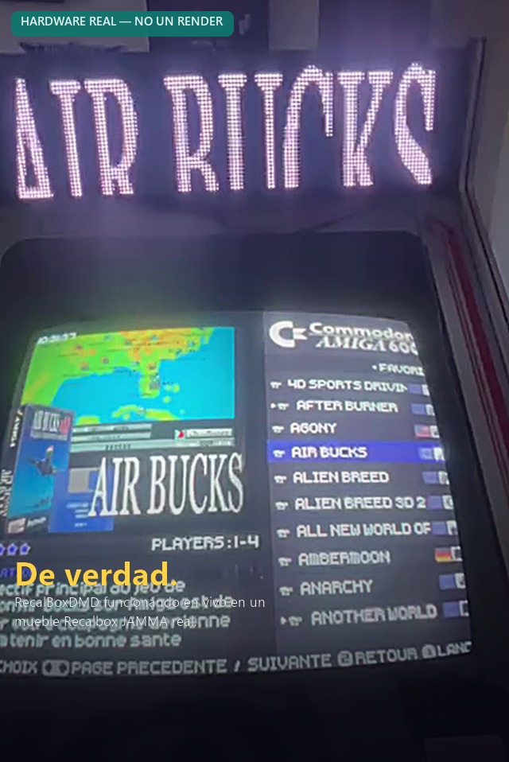

# RecalBoxDMD — Raw565 Edition

**Un verdadero marquee LED para tu mueble arcade Recalbox — visualización instantánea, incluso con un fullset MAME de 30 000 juegos.**

[🇬🇧 English](README.md) · [🇫🇷 Français](README.fr.md) · 🇪🇸 **Español**

<p align="center">
  
</p>

<p align="center">
  
</p>
<p align="center"><sub>📹 Imágenes reales, no un montaje — el marquee se actualiza en vivo al navegar · <a href="medias/dmd_in_action.mp4">ver el clip completo (MP4)</a></sub></p>

<p align="center">
  
  
  
  
</p>

<p align="center">
  
  
  
  
</p>

<p align="center">
  
  
  <a href="LICENSE"></a>
  
  
  
  
</p>

---

## ¿Qué es esto?

**RecalBoxDMD** convierte un pequeño **panel LED 128×32** (2 módulos HUB75 64×32 encadenados) en un verdadero marquee de arcade para tu mueble **Recalbox**: lanzas un juego y su logo/marquee se enciende en el panel en pocos milisegundos — además de un conjunto de 10 **temas de reloj** en pixel-art (Mario, Pac-Man, Tetris, Space Invaders, Pong...) y un pack incluido de unos **600 GIFs retro** para el modo de espera/atracción.

Es un fork de [RetroBoxLED de Jamyz](https://github.com/Jamyz/RetroBoxLED), reconstruido alrededor de un formato de píxeles propio, **raw565**, y una **caja de herramientas de PC (GUI de Windows)** para resolver un problema concreto: en colecciones grandes (fullset MAME, FBNeo...), el firmware original en PNG/GIF terminaba congelándose o mostrando pantalla negra varios segundos entre cada juego. Esta edición, no.

|                          | PNG/GIF original | **RecalBoxDMD Raw565 Edition** |
|--------------------------|--------------------|----------------------------------|
| Tiempo de visualización por juego | 500 ms – 3 s+     | **5 – 15 ms**                    |
| RAM necesaria en el ESP32 | 50-100 KB         | **8 KB**                         |
| Fullset MAME (30 000 juegos) | congela 5-10 s      | **sin congelación, sin pantalla negra** |
| Puesta en marcha           | manual, imagen por imagen | **caja de herramientas de PC, un clic** |

> ### 🚀 Lo esencial: un clic construye toda la tarjeta SD
>
> Apunta la **caja de herramientas de PC** a tu carpeta de ROMs y pulsa **Iniciar** (**Modo 1 — AUTO**). Encadena todo por sí sola — detección de la versión de Recalbox, extracción del gamelist, conversión raw565, caché de bigramas, imágenes por defecto, scripts de Recalbox — hasta obtener una tarjeta SD lista para usar, y luego se ofrece a copiarla en tu tarjeta. **Inserta esa tarjeta SD en el DMD, enciéndelo, y ya está.** Sin configuración manual archivo por archivo, nunca.

---

## Índice

1. [¿Qué es esto?](#qué-es-esto)
2. [Características clave](#características-clave)
3. [Cómo funciona](#cómo-funciona)
4. [Capturas de pantalla](#capturas-de-pantalla--la-caja-de-herramientas-de-pc)
5. [Inicio rápido](#inicio-rápido)
6. [Hardware](#hardware)
7. [Caja de herramientas de PC — referencia de modos](#caja-de-herramientas-de-pc--referencia-de-modos)
8. [10 temas de reloj retro](#10-temas-de-reloj-retro)
9. [El pack de 600 GIFs](#el-pack-de-600-gifs)
10. [Firmware — compilar y flashear](#firmware--compilar-y-flashear)
11. [Configuración (`config.ini`)](#configuración-configini)
12. [Configuración web — en vivo, en el navegador](#configuración-web--en-vivo-en-el-navegador)
13. [MQTT y Telnet](#mqtt-y-telnet)
14. [El formato raw565 en detalle](#el-formato-raw565-en-detalle)
15. [Estructura de la tarjeta SD](#estructura-de-la-tarjeta-sd)
16. [Estructura del repositorio](#estructura-del-repositorio)
17. [Solución de problemas](#solución-de-problemas)
18. [Créditos y licencia](#créditos-y-licencia)

---

## Características clave

- ⚡ **Motor raw565** — PNG → `.raw565` (8192 bytes, RGB565), GIF → `.raw565pack` + `.meta`. Sin decodificación en el dispositivo: el ESP32 solo lee bytes y los envía tal cual al panel. 5-15 ms por visualización.
- 🖼️ **Marquees fijas y animadas, por juego o por sistema** — un juego/sistema puede tener un logo fijo (`.raw565`, desde un PNG) **o** un marquee animado completo (`.raw565pack`, desde un GIF); el firmware reproduce el que esté presente, sin configuración alguna.
- 🎯 **Sistema de máscara para colecciones enormes (MAME, FBNeo...)** — los sistemas marcados como **«L»** (Large/lento) muestran de inmediato una imagen por defecto en caché mientras la real se decodifica en segundo plano, así que el panel **nunca se queda en negro**, ni siquiera recorriendo un fullset de 30 000 juegos.
- 🖼️ **Imagen de respaldo personalizada** — se incluyen 4 imágenes por defecto listas para usar (Recalbox, JAMMA, RGB Dual, RGB Dual 2), o elige **tu propia imagen** desde la caja de herramientas de PC como respaldo global, mostrado cuando nada más coincide.
- 🧮 **Caché de juegos por bigramas** — una caché indexada compacta (`games_cache.bin`) evita listar decenas de miles de archivos de la SD en tiempo de ejecución; las búsquedas son casi instantáneas.
- 🕹️ **10 temas de reloj pixel-art integrados** — Super Mario, Tetris, Pac-Man, Space Invaders, Pong, Neon, Matrix, Fire, Rainbow y un nivel 1-1 con scroll — se muestran periódicamente entre juegos (o a tiempo completo), tema seleccionable desde la web con **vista previa en vivo en el panel físico**.
- 📦 **~600 GIFs retro gratuitos incluidos** — descarga opcional en un clic (Arcade, Consolas, Ordenadores, Pinball, Halloween, Navidad y más) para tus playlists en modo de espera.
- 🖥️ **Caja de herramientas de PC para Windows en un clic** (GUI, FR/EN/ES) — desde ROMs en bruto + `gamelist.xml` hasta una tarjeta SD lista para usar: extracción consciente del scraping, conversión, caché y copia a la SD reanudable, todo en un clic de «Iniciar».
- 🌐 **Página de configuración web en vivo** servida por el ESP32 — WiFi, MQTT, brillo, playlist, temas de reloj (con vista previa instantánea en el panel) — sin necesidad de recompilar para ajustar nada.
- ⚡ **Flashea el firmware desde el navegador** — un [instalador web en un clic](https://shan-aya.github.io/RecalBoxDMD/) (Chrome/Edge) flashea el ESP32 por USB, sin Arduino IDE.
- 📡 **Integración MQTT** con Recalbox para mostrar juegos/sistemas/eventos en tiempo real, además de una consola **Telnet** para depuración en el dispositivo.
- 🌍 **Totalmente trilingüe** — tanto la interfaz web del firmware como la caja de herramientas de PC están disponibles en **francés, inglés y español**.
- 🗣️ **Imágenes de sistema/género multilingües** — el pack de respaldo `_defaults` (insignias de género, Favoritos, Últimos Jugados...) está disponible en francés y español, seleccionable desde la caja de herramientas de PC con una vista previa comparativa en vivo; los géneros aún no traducidos simplemente quedan en inglés.
- 🔁 **Scraping consciente de la versión de Recalbox** — apunta automáticamente a la etiqueta correcta de `gamelist.xml` y a la carpeta de medios adecuada para Recalbox 10.x / 9.x / legacy, con una guía de «cómo hacer el scrape» integrada.

---

## Cómo funciona

```
┌─────────────────────────────────────────────────────────────┐
│                          RECALBOX                             │
│   Lanza un juego → marquee[...].sh envía "mame/kof98"          │
│                         vía MQTT                                │
└──────────────────────────────┬────────────────────────────────┘
                                │
                                ▼
┌─────────────────────────────────────────────────────────────┐
│                 ESP32 + Panel LED HUB75 128×32                   │
│                                                                 │
│  Recibe "mame/kof98":                                            │
│   1. /systems/mame/kof98.raw565 (o .raw565pack)  → instantáneo  │
│   2. ¿no está? busca en games_cache.bin (índice de bigramas)    │
│   3. ¿sigue sin estar? muestra /systems/_defaults/mame.raw565   │
│   4. ¿sigue sin estar? muestra /systems/_defaults/default.raw565│
│                                                                 │
│   ⏱️  5-15 ms en total, sea cual sea el tamaño de la colección  │
└─────────────────────────────────────────────────────────────┘

           ┌───────────────────────────────────────────────┐
           │   RecalBoxDMD Toolkit  (prepara la tarjeta SD)  │
           │  Extrae las marquees desde gamelist.xml          │
           │  PNG → .raw565   /   GIF → .raw565pack + .meta   │
           │  Construye la caché de juegos por bigramas        │
           │  Marca los sistemas lentos ("L") para la máscara  │
           │  Descarga recursos gratuitos (_defaults + 600 GIFs)│
           │  Copia todo a la tarjeta SD (reanudable)          │
           └───────────────────────────────────────────────┘
```

---

## Capturas de pantalla — la caja de herramientas de PC

La herramienta incluye 9 temas visuales (SNES, Mega Drive, Dreamcast, PlayStation, N64, Neo Geo, Game Boy, Atari 2600, Aleatorio) además de su interfaz FR/EN/ES — algunos ejemplos:

| Pestaña Main (inglés · tema SNES) | Configuración — idioma y tema (inglés · tema Dreamcast) |
|---|---|
|  |  |

| Pestaña Main (francés · tema Mega Drive) | Pestaña Playlist (francés · tema Neo Geo) |
|---|---|
|  |  |

| Pestaña Main (español · tema PlayStation) | Pestaña Avanzado (español · tema Atari 2600) |
|---|---|
|  |  |

---

## Inicio rápido

<p align="center"><b>🚀 De cero a un marquee funcionando en 4 pasos 🚀</b></p>

<table align="center">
<tr>
<td align="center" width="70"><h2>1️⃣</h2></td>
<td>

**[Instala la caja de herramientas de PC](#instala-la-caja-de-herramientas-de-pc) + primer arranque**
Haz el scrape de tus juegos en Recalbox, apunta la herramienta a tu carpeta de ROMs, pulsa **Iniciar**.

</td>
</tr>
<tr>
<td align="center"><h2>2️⃣</h2></td>
<td>

**[Monta el DMD](#hardware)**
Une los dos paneles, coloca la placa DMDos, cablea — **~5 minutos, sin soldadura**.

</td>
</tr>
<tr>
<td align="center"><h2>3️⃣</h2></td>
<td>

**[Flashea el firmware](#firmware--compilar-y-flashear)**
Instalador web en un clic — **sin necesidad de Arduino IDE**.

</td>
</tr>
<tr>
<td align="center"><h2>4️⃣</h2></td>
<td>

**Inserta la tarjeta SD, enciende**
El primer arranque te guía por la configuración WiFi, y luego la **[página de configuración web](#configuración-web--en-vivo-en-el-navegador)** se encarga de todo lo demás (brillo, playlists, temas de reloj...).

</td>
</tr>
</table>

### Instala la caja de herramientas de PC

Se descarga de 4 formas — elige la que prefieras en la **[página de Releases](https://github.com/shan-aya/RecalBoxDMD/releases)** (los archivos `.exe`/`.msi` compilados no están en el propio repositorio, solo publicados ahí):

**Opción A — Instalador de Windows (recomendado)**

```
1. Descarga RecalBoxDMD_Toolkit_Setup.exe desde la página de Releases
2. Ejecútalo — acceso directo en el menú Inicio, icono de escritorio opcional, desinstalador real
3. Abre «RecalBoxDMD Toolkit» desde el menú Inicio
```

**Opción B — Ejecutable portable (sin instalación)**

```
1. Descarga RecalBoxDMD_GUI.exe desde la página de Releases
2. Ejecútalo directamente — sin instalación, sin necesidad de Python, archivo único
```

**Opción C — .msi (para despliegue mediante script/GPO)**

```
1. Descarga el .msi desde la página de Releases
2. msiexec /i "RecalBoxDMD Toolkit-1.0.0-win64.msi"   (o doble clic)
```

**Opción D — Desde el código fuente Python**

```
1. Descarga la carpeta tools/
2. Haz doble clic en install_and_run.bat — instala Python (vía winget,
   si falta), Pillow y Markdown, y luego abre la GUI
   (o manualmente: pip install Pillow Markdown && python run_gui.py)
```

### Primer arranque

```
1. Haz el scrape de tus juegos en Recalbox (ver «¿Cómo hacer el scrape?» en la
   herramienta, según tu versión de Recalbox — logo, marquee o logo recortado)
2. Abre la caja de herramientas → pestaña Main
3. Elige tu versión de Recalbox (10.x / 9.x / legacy)
4. Elige tu carpeta de ROMs (ej.: D:\Recalbox\share\roms)
5. Haz clic en Iniciar — el MODO 1 encadena todo el proceso automáticamente
6. Inserta la tarjeta SD → el botón parpadeante se ofrece a copiarla por ti
```

A continuación: [monta el hardware](#hardware) y [flashea el firmware](#firmware--compilar-y-flashear) — luego inserta esa tarjeta SD y enciende.

---

## Hardware

| Componente | Referencia | Precio aprox. |
|-----------|-----------|----------------|
| 🧠 Microcontrolador | ESP32 DevKit V1 USB-C (38 pines) | ~5 € |
| 🖥️ Panel LED | 2× paneles HUB75 RGB **P4, 64×32, 256×128 mm**, unidos uno junto al otro (→ 128×32) | ~15-25 €/panel |
| 🔌 Placa de conexión | **DMDos Board V3** (recomendada — incluye el lector SD, sin soldadura) | ~15 € |
| 💾 Lector SD | Módulo adaptador Micro SD SPI (integrado en la DMDos Board) | ~2 € |
| ⚡ Fuente de alimentación | 5V 4A+ | ~10 € |

<p align="center">
  
</p>

El montaje físico (paneles + placa DMDos + ESP32 + microSD) es idéntico al descrito en el sitio oficial **[dmdos.net](https://www.dmdos.net/)** de Mortaca — realmente rápido, sin soldadura, sin más herramienta que un destornillador:

1. **Une los dos paneles.** Usa las piezas de unión que vienen con la placa DMDos. Los tornillos no están incluidos — cualquier tornillo M3 que tengas en casa sirve (por ejemplo, recuperado de una regleta).
2. **Coloca la placa DMDos.** Una vez unidos, mantén la orientación de los componentes traseros igual en ambos lados. Verás dos conectores idénticos: uno de **entrada**, otro de **salida**. La placa solo funciona en el lado de **entrada** — elige la orientación que despeje fácilmente el soporte de plástico.
3. **Cablea la alimentación.** Antes de colocar el ESP32 encima, conecta los cables rojo/negro de alimentación de cada panel a los bornes de la placa según la serigrafía (rojo↔rojo, negro↔negro) — puedes conservar el conector suministrado y atornillar solo un pin, o pelar/recortar el cable para que encaje directamente en el borne. Une los dos paneles entre sí con el cable plano incluido.
4. **Tarjeta SD, ESP32, alimentación.** Inserta la tarjeta SD que preparaste con la caja de herramientas de PC (ver [Inicio rápido](#inicio-rápido)), conecta el ESP32 ya flasheado con el firmware RecalBoxDMD (ver [Firmware](#firmware--compilar-y-flashear)) encima de la placa, y alimenta todo por el puerto USB-C del ESP32.

<p align="center">
  <a href="https://www.dmdos.net/#montaje" title="Guía ilustrada completa en dmdos.net"></a>
  <a href="https://www.dmdos.net/#montaje" title="Guía ilustrada completa en dmdos.net"></a>
  <a href="https://www.dmdos.net/#montaje" title="Guía ilustrada completa en dmdos.net"></a>
  <a href="https://www.dmdos.net/#montaje" title="Guía ilustrada completa en dmdos.net"></a>
</p>
<p align="center"><sub>Las miniaturas enlazan a la guía oficial paso a paso en dmdos.net</sub></p>

📖 **Guía oficial ilustrada**: [dmdos.net → Hardware](https://www.dmdos.net/#hardware) · [dmdos.net → Montaje/Assembly](https://www.dmdos.net/#montaje) · [dmdos.net → Mueble/Frame](https://www.dmdos.net/#mueble)

> ⚠️ El sitio web de DMDos ofrece su propio firmware/sistema operativo, independiente. **No flashees el firmware de DMDos** si quieres usar RecalBoxDMD — solo se reutilizan el **hardware** (paneles, placa, marco) y la **guía de montaje**; el firmware y el contenido de la tarjeta SD provienen de este repositorio.

Marco imprimible en 3D por **Janibol** ([Retromojones](https://www.youtube.com/@retromojones)) en [Thingiverse](https://www.thingiverse.com/thing:6704880). Enlaces de compra actualizados: [dmdos.net](https://www.dmdos.net/).

---

## Caja de herramientas de PC — referencia de modos

La pestaña **Avanzado** de la GUI agrupa cada operación en 5 categorías plegables; el **Modo 1** de la pestaña **Main** las encadena todas por ti.

| Modo | Categoría | Nombre | Qué hace |
|------|-----------|--------|-----------|
| **1** | *(pestaña Main)* | **AUTO — todo** | Detección de versión Recalbox → extracción de gamelist → conversión raw565 → caché de bigramas → descarga de `_defaults` → instalación de scripts Recalbox → copia a la SD |
| 2 | 📥 GitHub | Descargar `_defaults` | Obtiene las imágenes de respaldo por defecto de cada sistema conocido |
| 11 | 📥 GitHub | **Pack 600 GIFs** | Descarga en un clic de la colección gratuita de GIFs (Arcade, Consolas, Ordenadores, Pinball, Halloween, Navidad, Logo y más) |
| 3 | 🗂️ Gamelist | Solo extracción | Lee `gamelist.xml`, copia la marquee/logo correcta según tu perfil de versión de Recalbox |
| 8 | 🗂️ Gamelist | Verificación de imágenes faltantes | Informa, por sistema/juego, si la imagen esperada realmente existe (ROMs / carpeta de trabajo / tarjeta SD) |
| 4 | 🖼️ Imágenes | Conversión raw565 | PNG → `.raw565`, GIF → `.raw565pack` + `.meta` |
| 5 | 🖼️ Imágenes | Redimensionado 128×32 | Redimensiona los PNG a la resolución del panel (formato imagen, sin conversión raw565) |
| 10 | 🖼️ Imágenes | Imagen de respaldo | Define/genera la imagen por defecto global que se muestra cuando nada más coincide |
| 6 | 🧮 Cachés | Caché de juegos | Construye `games_cache.bin` (índice de bigramas, 703 entradas) |
| 7 | 🧮 Cachés | Caché de sistemas | Construye `systems_cache.dat` (índice de sistemas + flags lento/rápido **«L»/«N»**) |
| 9 | 📜 Scripts | Instalar scripts de Recalbox | Copia los scripts de usuario marquee/recuperación WiFi/config web directamente al recurso compartido de red de la Recalbox |

Herramientas adicionales disponibles desde cada modo correspondiente: **«¿Cómo hacer el scrape?»** (capturas anotadas y específicas de tu versión de la pestaña Scraper de Recalbox), **«Limpiar carpetas antes del scrape»**, una **pestaña Playlist** para construir playlists de GIFs desde una tarjeta SD o carpetas del PC, un **umbral de sistema lento** ajustable (pestaña Configuración, 5000 archivos convertidos por defecto), y una **copia a la SD reanudable** que resiste una desconexión/fallo y puede reintentar solo los archivos fallidos.

---

## 10 temas de reloj retro

Se muestran periódicamente entre juegos (intervalo/duración configurables) o a tiempo completo; cada tema es una escena pixel-art hecha a mano, seleccionable desde la web, con una **vista previa en vivo instantánea enviada al panel físico** en cuanto eliges una.

<p align="center">
   
   
</p>
<p align="center">
   
   
</p>
<p align="center">
   
</p>

Super Mario · Tetris · Pac-Man · Space Invaders · Pong · Neon · Matrix · Fire · Rainbow · Level 1-1 (con scroll).

### Imágenes de respaldo

Se muestran cuando un juego/sistema no tiene marquee propia. Se incluyen 4 de serie — o aporta la tuya desde el selector de imagen de respaldo de la caja de herramientas de PC.

<p align="center">
  
  
  
  
</p>

---

## El pack de 600 GIFs

El **Modo 11** (o el botón «Pack 600 GIFs» de la pestaña Playlist) descarga una colección lista para reproducir de unos **600 GIFs retro**, organizada por categorías, directamente desde este repositorio (`carte SD/gifs/`) — sin sitios externos, sin cuentas:

| Categoría | Categoría | Categoría |
|---|---|---|
| Arcade | Consolas | Ordenadores |
| Pinball (corto) | Pinball (historia) | Logo |
| Halloween | Navidad | Otros / Suite de pruebas |

Apunta una playlist a cualquier subconjunto de estas carpetas (pestaña Playlist) para construir tu propia rotación de modo de espera — los GIFs animados se reproducen por la misma vía rápida `.raw565pack` que las marquees de juegos, así que la reproducción se mantiene fluida incluso en el ESP32.

> ℹ️ Una categoría (`XXX_Mature`) contiene pixel-art de temática adulta para quien lo quiera en su propio mueble — totalmente opcional y nunca seleccionada por defecto.

### ¿De dónde viene este pack?

Estos 600 GIFs son la **muestra gratuita** de la colección de animaciones «pixel perfect» para relojes DMD de **eLLuiGi** (RpiTeaM) — más de 4 años de trabajo de curación, redistribuida aquí con permiso para instalarla en un clic, sin sitios de terceros ni cuentas.

La colección completa va mucho más allá: el **«ULTIMATE GIFS DLC»** reúne unas **11 000 animaciones pixel perfect** (1441 Arcade, 3601 Consolas, 849 Ordenadores, más Pinball/Halloween/Navidad/Logo...). No está alojada en este repositorio — es el pack de pago del propio creador, consíguelo directamente aquí:

- 🔗 **Portal de RpiTeaM**: [rpiteam.carrd.co](https://rpiteam.carrd.co/)
- 🔗 **Hilo del foro (detalles y acceso)**: [neo-arcadia.com — «ULTIMATE GIFS DLC»](https://www.neo-arcadia.com/forum/viewtopic.php?t=67065)

Cualquier GIF funciona igual sea cual sea su origen — pero añade siempre los packs adicionales a través de la **pestaña Playlist de la caja de herramientas de PC** (apuntando a la carpeta en tu PC) o de la **página Medios de la configuración web** (subida), nunca copiando archivos directamente en la tarjeta SD: eso es lo que reconstruye la playlist y la caché de GIFs que el firmware realmente lee. Los archivos copiados directamente en la SD fuera de esas dos vías no aparecerán hasta que lo hagas.

---

## Firmware — compilar y flashear

### 🌐 Opción A — Flashear desde el navegador (lo más sencillo, sin instalar nada)

> [👉 **Abrir el instalador web de RecalBoxDMD**](https://shan-aya.github.io/RecalBoxDMD/)

Con **Chrome o Edge**, conecta el ESP32 por USB, haz clic en **Instalar**, elige el puerto COM, y listo en un minuto aproximadamente — nada que instalar en tu PC, sin Arduino IDE. Flashea el último firmware precompilado directamente desde [`binaries/`](binaries/) usando [ESP Web Tools](https://esphome.github.io/esp-web-tools/). Marca **«Erase device»** en una primera instalación (o al venir de otro firmware, p. ej. DMDos) para borrar por completo la memoria flash antes.

### 🛠️ Opción B — Arduino IDE (para compilar desde el código fuente / personalizar)

1. Abre `RecalBox_DMD.ino` en el **Arduino IDE**.
2. Instala estas bibliotecas (Programa → Incluir Librería → Gestionar Bibliotecas):

| Biblioteca | Utilidad |
|---|---|
| [ESP32-HUB75-MatrixPanel-I2S-DMA](https://github.com/mrfaptastic/ESP32-HUB75-MatrixPanel-I2S-DMA) | Control DMA del panel LED |
| [AnimatedGIF](https://github.com/bitbank2/AnimatedGIF) | Decodificación de GIF (ruta de respaldo) |
| [pngle](https://github.com/kikuchan/pngle) | Decodificación de PNG (ruta de respaldo, incluida en el sketch) |
| [WiFiManager](https://github.com/tzapu/WiFiManager) | Configuración WiFi |
| [Adafruit GFX Library](https://github.com/adafruit/Adafruit-GFX-Library) | Renderizado de texto/formas |
| [PubSubClient](https://github.com/knolleary/pubsubclient) | MQTT |
| [ArduinoJson](https://github.com/bblanchon/ArduinoJson) | (De)serialización de la configuración y la web |

3. Herramientas → Placa: **ESP32 Dev Module**, Tamaño de flash **4 MB**, Esquema de particiones **Huge APP**.
4. Selecciona el puerto COM correcto y pulsa **Subir**.

### ⌨️ Opción C — `esptool.py` (línea de comandos)

Los mismos binarios precompilados que usa el instalador web (bootloader/particiones/app/imagen fusionada) están en [`binaries/`](binaries/):

```bash
esptool.py --chip esp32 --port COM3 --baud 921600 write_flash -z 0x10000 RecalBox_DMD.ino.bin
# o, flasheo en un solo archivo:
esptool.py --chip esp32 --port COM3 write_flash 0x0 RecalBox_DMD.ino.merged.bin
```

### Asignación de pines (por defecto)

| Tarjeta SD (SPI) | GPIO |  | HUB75 | GPIO |  | HUB75 | GPIO |
|---|---|---|---|---|---|---|---|
| CS | 5 | | CLK | 16 | | R1 / R2 | 25 / 14 |
| MOSI | 23 | | OE | 15 | | G1 / G2 | 26 / 12 |
| MISO | 19 | | LAT | 4 | | B1 / B2 | 27 / 13 |
| SCLK | 18 | | A/B/C/D | 33 / 32 / 22 / 17 | | E | -1 |

---

## Configuración (`config.ini`)

No hace falta escribir ni copiar este archivo a mano: se crea automáticamente — bien por la **caja de herramientas de PC** (el Modo 1 lo escribe al final del proceso), bien por el propio **ESP32**, que ofrece su propia página de configuración WiFi en el primer arranque o cuando no consigue conectarse. A partir de ahí, cada valor de abajo se edita en vivo desde la **página de configuración web** (siguiente sección) — sin tener que tocar la tarjeta SD. Como referencia, esto es lo que contiene:

```ini
# Info
info=1                        # 0 = sin info al arrancar, 1 = mostrar info al arrancar

# Pantalla
brightness=40                 # brillo del panel 0-100 %

# Playlist
playlist=RecalBox_intros.txt  # se reproduce desde /playlist
random=1                      # 0 = secuencial, 1 = aleatorio

# Wi-Fi
wifi_enabled=1
wifi_ssid=mi_wifi
wifi_password=mi_contraseña
wifi_static_enabled=1
wifi_static_ip=192.168.1.240
wifi_gateway=192.168.1.1
wifi_subnet=255.255.255.0

# MQTT
recalbox_ip=192.168.1.104     # IP fija de tu Recalbox

# Reloj (temas de reloj retro)
[CLOCK]
CLOCK_ENABLED=1
CLOCK_THEME=-1                # -1=aleatorio, 0=Mario ... 9=Level 1-1
CLOCK_INTERVAL=5              # número de GIFs antes de mostrar el reloj
CLOCK_DURATION=60             # segundos que el reloj permanece en pantalla
TZ=CET-1CEST,M3.5.0,M10.5.0/3
```

---

## Configuración web — en vivo, en el navegador

Escribe la IP del ESP32 (mostrada al arrancar, o visible en el propio panel) en el navegador de un móvil o PC: obtienes un sitio de configuración completo, dividido en 4 páginas de carga rápida, trilingüe (FR/EN/ES), con ayuda integrada — sin apps, sin recompilar.

**💡 Pantalla y listas** — brillo del panel con una **vista previa en vivo enviada directamente al panel físico** mientras mueves el control deslizante, arranque silencioso o normal, playlist por defecto + reproducción aleatoria, y gestión de playlists (crear una nueva playlist directamente desde las carpetas de GIFs ya presentes en la SD, editar o borrar las existentes — para carpetas con muchos archivos, usa mejor la caja de herramientas de PC, pensada para eso).

<p align="center"></p>

**📶 Wi-Fi y Bluetooth** — escaneo y selección de red, contraseña, IP estática (puerta de enlace/máscara/DNS), interruptor de Bluetooth (útil si entra en conflicto con un mando como el 8BitDo Pro 3), y la IP de Recalbox usada para la conexión MQTT.

<p align="center"></p>

**⏰ Reloj** — activar/desactivar, selector de tema con una **vista previa en vivo instantánea enviada al panel físico** mientras la página permanece abierta, color neón personalizado, intervalo en número de GIFs o en minutos, duración en pantalla, y zona horaria.

<p align="center"></p>

**💿 Medios** — explora y borra carpetas de GIFs directamente en la tarjeta SD, y sube GIFs uno a uno desde el navegador (cómodo para pocos archivos; para transferencias masivas, usa la caja de herramientas de PC).

<p align="center"></p>

---

## MQTT y Telnet

```
Recalbox → marquee[rungame,endgame,...].sh → MQTT → ESP32 → Panel LED

1. Lanzas "King of Fighters '98"
2. El script bash de usuario detecta el evento → publica "mame/kof98"
3. El ESP32 busca, en orden:
   a. /systems/mame/kof98.raw565 (o .raw565pack)   ← instantáneo
   b. índice de bigramas de games_cache.bin          ← acelerado
   c. /systems/_defaults/mame.raw565                 ← respaldo de sistema
   d. /systems/_defaults/default.raw565               ← respaldo global
4. Se muestra en menos de 15 ms
```

Instala el script de usuario con el **Modo 9** de la caja de herramientas, o copia `marquee[...].sh` manualmente a `/recalbox/share/userscripts/`.

### 🎮 Control manual desde el menú de Recalbox

El **Modo 9** también instala scripts que puedes lanzar a mano desde Recalbox (**START → Configuración avanzada → Scripts de usuario**), sin tocar la tarjeta SD:

| Script | Efecto |
|---|---|
| **WiFi Recovery DMD** | Vuelve a poner el DMD en modo punto de acceso (AP) de emergencia para reconfigurar el WiFi. |
| **Config Web DMD** | Abre la página de configuración web del DMD y muestra su IP en Recalbox para acceder directamente. |
| **Reboot DMD** | Reinicia el DMD de forma remota. |
| **Luminosité DMD +10% / -10%** | Ajusta el brillo de la pantalla en pasos de 10 puntos porcentuales (limitado 0-100%), aplicado al instante y guardado en `config.ini`. |

Todos usan el mismo canal MQTT que el puente marquee, sin interrumpir nunca lo que se muestra en pantalla.

Incluye una consola **Telnet** para depuración en el dispositivo:
```
telnet <ip-esp32>
> help
```

---

## El formato raw565 en detalle

**`.raw565`** — imagen fija (desde un PNG): exactamente `128 × 32 × 2 = 8192 bytes`, RGB565 en bruto (5-6-5 bits), leída en una sola operación SD y enviada directamente (`drawRGBBitmap`).

**`.raw565pack` + `.meta`** — imagen animada (desde un GIF): todos los fotogramas concatenados como bloques raw565 en `.raw565pack`; los retardos por fotograma (`uint16`, ms) en `.meta`, cargados una sola vez en RAM. Una apertura SD + un seek por fotograma, cero decodificación de GIF en el dispositivo.

**Caché de juegos por bigramas** (`games_cache.bin`) — un índice de 703 entradas por sistema (una entrada por prefijo de 2 letras, ej. `KO` para `kof98`) evita tener que listar jamás una carpeta con decenas de miles de archivos; una búsqueda salta directamente al fragmento correcto de la caché.

**Sistema de máscara** — cualquier sistema marcado como **«L»** (por encima del umbral configurable, 5000 archivos convertidos por defecto — MAME, FBNeo...) muestra *de inmediato* su imagen por defecto en caché mientras una tarea en segundo plano localiza y decodifica la real, así que el panel **nunca** se queda en blanco.

---

## Estructura de la tarjeta SD

```
📁 TARJETA SD (FAT32)
├── config.ini
├── systems/
│   ├── <sistema>/
│   │   ├── <juego>.raw565            ← marquee fija
│   │   ├── <juego>.raw565pack        ← marquee animada (fotogramas)
│   │   └── <juego>.meta               ← marquee animada (tiempos)
│   └── _defaults/
│       ├── default.raw565             ← respaldo global
│       └── <sistema>.raw565           ← respaldo por sistema, en el idioma
│                                         elegido (inglés por defecto; las
│                                         versiones FR/ES sobrescriben este
│                                         mismo archivo si se seleccionan
│                                         en la herramienta de PC)
├── gifs/                              ← playlists de modo de espera (aquí llega el pack de 600 GIFs)
│   ├── Arcade/  Consoles/  Computers/  Pinball_Short/  Pinball_Story/
│   └── Halloween/  XMAS/  Logo/  Other/ ...
├── playlists/
│   └── <nombre_playlist>.txt
├── games_cache.bin                    ← índice de bigramas
└── systems_cache.dat                  ← índice de sistemas + flags L/N
```

---

## Estructura del repositorio

```
RecalBox_DMD.ino / *.h        ← código fuente del firmware ESP32 (proyecto Arduino IDE)
binaries/                     ← imágenes de firmware precompiladas (bootloader/app/fusionada)
tools/                        ← caja de herramientas de PC (GUI Python, FR/EN/ES) + build de Windows
carte SD/                     ← contenido de la tarjeta SD listo para copiar (gifs, defaults del sistema, scripts)
medias/                       ← capturas de pantalla, GIFs de demostración de los temas de reloj, kit de prensa
docs/                          ← GitHub Pages: instalador web (shan-aya.github.io/RecalBoxDMD)
```

---

## Solución de problemas

| Problema | Solución |
|---|---|
| «Pillow no está instalado» | Se instala automáticamente en el primer arranque; si falla: `pip install Pillow` |
| «API de GitHub inaccesible» | Las descargas de `_defaults`/pack de 600 GIFs necesitan conexión a internet; reinténtalo más tarde (puede haber límite de peticiones) |
| No se detecta ninguna unidad extraíble | Inserta/comprueba que la tarjeta SD sea visible en el Explorador de Windows |
| El ESP32 no muestra nada | Comprueba la alimentación (5V 4A mín.), que `config.ini` esté en la raíz de la SD, el cableado HUB75; prueba Telnet `help` |
| ESP32 no detectado (sin puerto COM) | Instala los drivers USB: [CP2102 (Silicon Labs)](https://www.silabs.com/developers/usb-to-uart-bridge-vcp-drivers) o [CH340/CH341](https://learn.sparkfun.com/tutorials/how-to-install-ch340-drivers/all) |
| Visualización lenta / pantalla negra entre juegos | Confirma que has usado el **Modo 1**; comprueba que el sistema esté marcado como `L` en `systems_cache.dat`; sube el umbral de flag lento (pestaña Configuración) si tu SD es rápida |
| Aparece la imagen equivocada (carátula en vez del logo) | Revisa el perfil de **versión de Recalbox** y usa **«¿Cómo hacer el scrape?»**; ejecuta el **Modo 8** para verificar qué hay realmente presente |

---

## Créditos y licencia

- **Proyecto original RetroBoxLED**: [Jamyz](https://github.com/Jamyz/RetroBoxLED) — la base del firmware ESP32 y la idea original
- **Raw565 Edition**: **Shan_ayA** — formato raw565, caché de bigramas, sistema de máscara, caja de herramientas de PC, temas de reloj, gestión de versiones de Recalbox, vista previa web en vivo
- **Inspiración**: [RetroPixelLED](https://github.com/fjgordillo86/RetroPixelLED) de fjgordillo86
- **Pack de 600 GIFs**: **eLLuiGi** / [RpiTeaM](https://rpiteam.carrd.co/) — muestra gratuita de su colección de GIFs retro
- **Hardware y guía de montaje**: [Mortaca — DMDos Board](https://www.mortaca.com/) / [dmdos.net](https://www.dmdos.net/)
- **Marco 3D**: Janibol — [Retromojones](https://www.youtube.com/@retromojones)
- **Comunidad**: [Recalbox](https://www.recalbox.com/)
- **Desarrollo**: escrito con la asistencia de [Claude](https://www.anthropic.com/claude) (Anthropic) — código asistido por IA en todo el firmware y la caja de herramientas de PC

📜 Historial completo de versiones: [CHANGELOG.es.md](CHANGELOG.es.md)

Bajo licencia [MIT](LICENSE).

☕ Si este proyecto te resulta útil: [dona vía PayPal](https://www.paypal.com/paypalme/felysaya)

<p align="center"><i>RecalBoxDMD Raw565 Edition — Recalbox + un verdadero marquee LED, instantáneo incluso con 30 000 juegos de MAME.</i> 🎮⚡</p>
