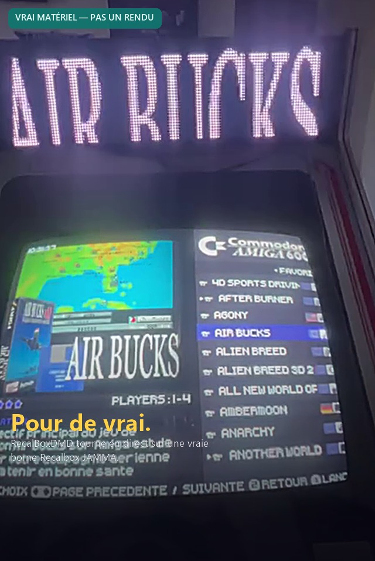
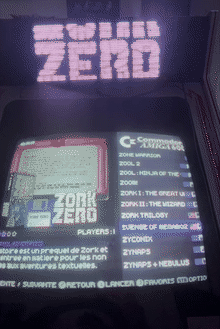
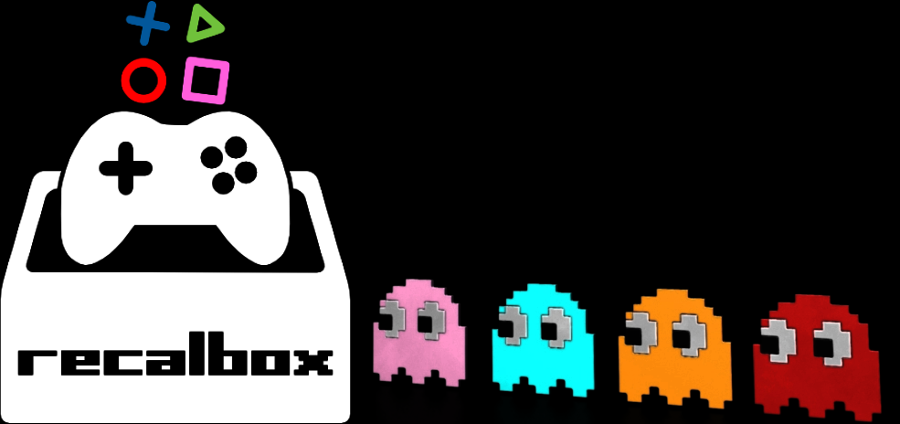
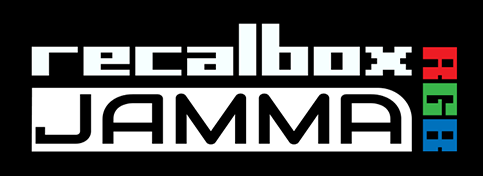
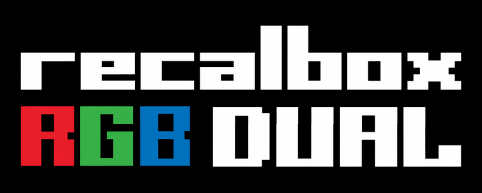
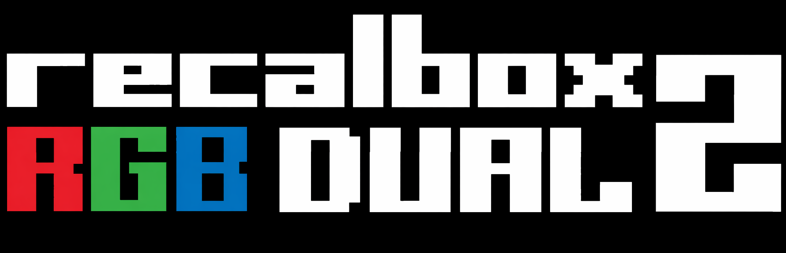
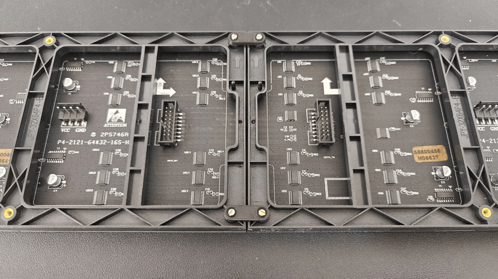
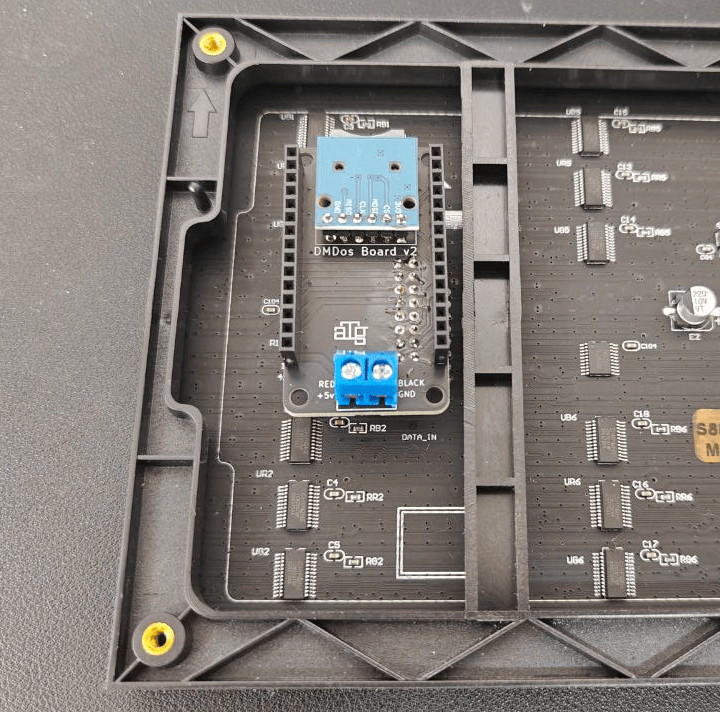
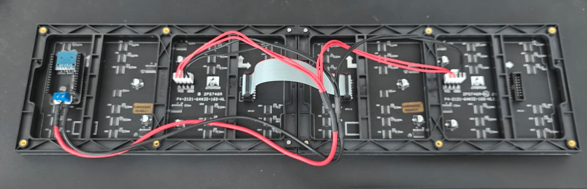
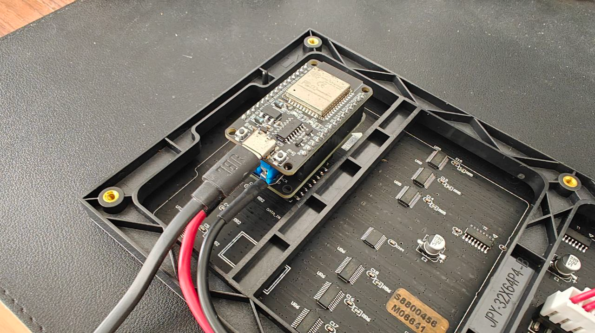

# RecalBoxDMD — Raw565 Edition

**Un vrai panneau marquee lumineux pour votre borne d'arcade Recalbox — affichage instantané, même avec un fullset MAME de 30 000 jeux.**

[🇬🇧 English](README.md) · 🇫🇷 **Français** · [🇪🇸 Español](README.es.md)

<p align="center">
  
</p>

<p align="center">
  
</p>
<p align="center"><sub>📹 Vraies images, pas un montage — le marquee se met à jour en direct pendant la navigation · <a href="medias/dmd_in_action.mp4">voir le clip complet (MP4)</a></sub></p>

<p align="center">
  
  
  
  
</p>

<p align="center">
  
  
  
  
</p>

<p align="center">
  <a href="LICENSE"></a>
  
  
  
  
</p>

---

## C'est quoi ?

**RecalBoxDMD** transforme un petit **panneau LED 128×32** (2 modules HUB75 64×32 chaînés) en un vrai marquee d'arcade pour votre borne **Recalbox** : lancez un jeu, son logo/marquee s'allume sur le panneau en quelques millisecondes — plus un jeu de 10 **thèmes horloge** pixel-art (Mario, Pac-Man, Tetris, Space Invaders, Pong...) et un pack fourni d'environ **600 GIFs rétro** pour le mode attente/veille.

C'est un fork de [RetroBoxLED de Jamyz](https://github.com/Jamyz/RetroBoxLED), reconstruit autour d'un format pixel maison, le **raw565**, et d'une **boîte à outils PC (GUI Windows)** pour résoudre un problème précis : sur les grosses collections (fullset MAME, FBNeo...), le firmware original en PNG/GIF finissait par geler ou afficher un écran noir plusieurs secondes entre deux jeux. Cette édition, non.

|                          | PNG/GIF d'origine | **RecalBoxDMD Raw565 Edition** |
|--------------------------|--------------------|----------------------------------|
| Temps d'affichage par jeu | 500 ms – 3 s+     | **5 – 15 ms**                    |
| RAM nécessaire sur l'ESP32 | 50-100 Ko         | **8 Ko**                         |
| Fullset MAME (30 000 jeux) | freeze 5-10 s      | **aucun freeze, aucun écran noir** |
| Mise en place              | manuelle, image par image | **boîte à outils PC, un clic** |

> ### 🚀 L'essentiel : un clic construit toute la carte SD
>
> Pointez la **boîte à outils PC** vers votre dossier ROMs et cliquez sur **Démarrer** (**Mode 1 — AUTO**). Elle enchaîne tout, toute seule — détection de la version Recalbox, extraction du gamelist, conversion raw565, cache bigramme, images par défaut, scripts Recalbox — jusqu'à une carte SD prête à l'emploi, puis propose de la copier sur votre carte. **Insérez cette carte SD dans le DMD, allumez, et c'est terminé.** Aucune configuration manuelle fichier par fichier, jamais.

---

## Sommaire

1. [C'est quoi ?](#cest-quoi-)
2. [Fonctionnalités clés](#fonctionnalités-clés)
3. [Comment ça marche](#comment-ça-marche)
4. [Captures d'écran](#captures-décran--la-boîte-à-outils-pc)
5. [Démarrage rapide](#démarrage-rapide)
6. [Matériel](#matériel)
7. [Boîte à outils PC — référence des modes](#boîte-à-outils-pc--référence-des-modes)
8. [10 thèmes horloge rétro](#10-thèmes-horloge-rétro)
9. [Le pack de 600 GIFs](#le-pack-de-600-gifs)
10. [Firmware — compiler et flasher](#firmware--compiler-et-flasher)
11. [Configuration (`config.ini`)](#configuration-configini)
12. [Configuration web — en direct, dans le navigateur](#configuration-web--en-direct-dans-le-navigateur)
13. [MQTT & Telnet](#mqtt--telnet)
14. [Le format raw565 en détail](#le-format-raw565-en-détail)
15. [Structure de la carte SD](#structure-de-la-carte-sd)
16. [Structure du dépôt](#structure-du-dépôt)
17. [Dépannage](#dépannage)
18. [Crédits & Licence](#crédits--licence)

---

## Fonctionnalités clés

- ⚡ **Moteur raw565** — PNG → `.raw565` (8 192 octets, RGB565), GIF → `.raw565pack` + `.meta`. Aucun décodage sur l'ESP32 : il lit des octets et les envoie tels quels au panneau. 5-15 ms par affichage.
- 🖼️ **Marquees fixes et animées, par jeu ou par système** — un jeu/système peut avoir un logo fixe (`.raw565`, depuis un PNG) **ou** un marquee animé complet (`.raw565pack`, depuis un GIF) ; le firmware joue celui qui est présent, sans aucune configuration.
- 🎯 **Système de masque pour les grosses collections (MAME, FBNeo...)** — les systèmes marqués **« L »** (Large/lent) affichent immédiatement une image par défaut en cache pendant que la vraie image se décode en tâche de fond : le panneau **ne reste jamais noir**, même en enchaînant un fullset de 30 000 jeux.
- 🖼️ **Image de secours personnalisée** — 4 images par défaut sont fournies (Recalbox, JAMMA, RGB Dual, RGB Dual 2), ou choisissez **votre propre image** depuis la boîte à outils PC comme image de secours globale, affichée quand rien d'autre ne correspond.
- 🧮 **Cache de jeux bigramme** — un cache indexé compact (`games_cache.bin`) évite de lister des dizaines de milliers de fichiers SD à l'exécution ; les recherches sont quasi instantanées.
- 🕹️ **10 thèmes horloge pixel-art intégrés** — Super Mario, Tetris, Pac-Man, Space Invaders, Pong, Neon, Matrix, Fire, Rainbow, et un niveau 1-1 défilant — affichés périodiquement entre les jeux (ou en continu), thème sélectionnable depuis la page web avec **aperçu en direct sur le panneau physique**.
- 📦 **~600 GIFs rétro gratuits inclus** — téléchargement en un clic (Arcade, Consoles, Ordinateurs, Flipper, Halloween, Noël, et plus) pour vos playlists d'attente.
- 🖥️ **Boîte à outils PC Windows en un clic** (GUI, FR/EN/ES) — des ROMs brutes + `gamelist.xml` jusqu'à une carte SD prête à l'emploi : extraction consciente du scraping, conversion, cache, et copie SD reprenable, le tout en un clic « Démarrer ».
- 🌐 **Page de configuration web en direct** servie par l'ESP32 — WiFi, MQTT, luminosité, playlist, thèmes horloge (avec aperçu instantané sur le panneau) — aucune recompilation nécessaire pour ajuster les réglages.
- ⚡ **Flashage du firmware depuis le navigateur** — un [installateur web en un clic](https://shan-aya.github.io/RecalBoxDMD/) (Chrome/Edge) flashe l'ESP32 en USB, sans Arduino IDE.
- 📡 **Intégration MQTT** avec Recalbox pour l'affichage en temps réel des jeux/systèmes/événements, plus une console **Telnet** pour le débogage sur l'appareil.
- 🌍 **Entièrement trilingue** — l'interface web du firmware et la boîte à outils PC sont toutes deux disponibles en **français, anglais et espagnol**.
- 🔁 **Scraping conscient de la version Recalbox** — cible automatiquement la bonne balise `gamelist.xml` et le bon dossier média pour Recalbox 10.x / 9.x / legacy, avec un guide « comment scraper » intégré.

---

## Comment ça marche

```
┌─────────────────────────────────────────────────────────────┐
│                         RECALBOX                              │
│   Lance un jeu → marquee[...].sh envoie "mame/kof98"          │
│                        via MQTT                                │
└──────────────────────────────┬────────────────────────────────┘
                                │
                                ▼
┌─────────────────────────────────────────────────────────────┐
│                ESP32 + Panneau LED HUB75 128×32                 │
│                                                                 │
│  Reçoit "mame/kof98" :                                          │
│   1. /systems/mame/kof98.raw565 (ou .raw565pack)  → instantané │
│   2. pas trouvé ? recherche dans games_cache.bin (bigramme)    │
│   3. toujours pas ? affiche /systems/_defaults/mame.raw565     │
│   4. toujours pas ? affiche /systems/_defaults/default.raw565  │
│                                                                 │
│   ⏱️  5-15 ms au total, quelle que soit la taille de la collection │
└─────────────────────────────────────────────────────────────┘

           ┌───────────────────────────────────────────────┐
           │     RecalBoxDMD Toolkit  (prépare la carte SD)  │
           │  Extrait les marquees depuis gamelist.xml        │
           │  PNG → .raw565   /   GIF → .raw565pack + .meta   │
           │  Construit le cache de jeux bigramme              │
           │  Marque les systèmes lents ("L") pour le masque   │
           │  Télécharge les assets gratuits (_defaults + 600 GIFs) │
           │  Copie le tout sur la carte SD (reprenable)       │
           └───────────────────────────────────────────────┘
```

---

## Captures d'écran — la boîte à outils PC

L'outil embarque 9 habillages visuels (SNES, Mega Drive, Dreamcast, PlayStation, N64, Neo Geo, Game Boy, Atari 2600, Aléatoire) en plus de son interface FR/EN/ES — quelques exemples :

| Onglet Main (anglais · thème SNES) | Paramètres — langue & thème (anglais · thème Dreamcast) |
|---|---|
|  |  |

| Onglet Main (français · thème Mega Drive) | Onglet Playlist (français · thème Neo Geo) |
|---|---|
|  |  |

| Onglet Main (espagnol · thème PlayStation) | Onglet Avancé (espagnol · thème Atari 2600) |
|---|---|
|  |  |

---

## Démarrage rapide

La boîte à outils PC se télécharge sous 3 formes — prenez celle que vous préférez sur la **[page Releases](https://github.com/shan-aya/RecalBoxDMD/releases)** (les fichiers `.exe`/`.msi` compilés ne sont pas dans le dépôt lui-même, seulement publiés là-bas) :

**Option A — Installateur Windows (recommandé)**

```
1. Téléchargez RecalBoxDMD_Toolkit_Setup.exe depuis la page Releases
2. Lancez-le — raccourci menu Démarrer, icône bureau optionnelle, vrai désinstalleur
3. Lancez « RecalBoxDMD Toolkit » depuis le menu Démarrer
```

**Option B — Exécutable portable (sans installation)**

```
1. Téléchargez RecalBoxDMD_GUI.exe depuis la page Releases
2. Lancez-le directement — aucune installation, aucun Python requis, fichier unique
```

**Option C — .msi (pour un déploiement scripté/GPO)**

```
1. Téléchargez le .msi depuis la page Releases
2. msiexec /i "RecalBoxDMD Toolkit-1.0.0-win64.msi"   (ou double-clic)
```

**Option D — Depuis les sources Python**

```
1. Récupérez le dossier tools/
2. Double-cliquez sur install_and_run.bat — installe Python (via winget,
   si absent), Pillow et Markdown, puis lance la GUI
   (ou manuellement : pip install Pillow Markdown && python run_gui.py)
```

**Premier lancement recommandé**

```
1. Scrapez vos jeux dans Recalbox (voir « Comment scraper ? » dans l'outil,
   selon votre version Recalbox — logo, marquee ou logo détouré)
2. Lancez la boîte à outils → onglet Main
3. Choisissez votre version Recalbox (10.x / 9.x / legacy)
4. Choisissez votre dossier ROMs (ex : D:\Recalbox\share\roms)
5. Cliquez Démarrer — le MODE 1 enchaîne tout le pipeline automatiquement
6. Insérez la carte SD → le bouton clignotant propose de la copier pour vous
7. Insérez la SD dans l'ESP32, allumez — terminé
```

---

## Matériel

| Composant | Référence | Prix indicatif |
|-----------|-----------|----------------|
| 🧠 Microcontrôleur | ESP32 DevKit V1 USB-C (38 broches) | ~5 € |
| 🖥️ Panneau LED | 2× panneaux HUB75 RGB **P4, 64×32, 256×128 mm**, assemblés côte à côte (→ 128×32) | ~15-25 €/panneau |
| 🔌 Carte de connexion | **DMDos Board V3** (recommandée — intègre le lecteur SD, aucune soudure) | ~15 € |
| 💾 Lecteur SD | Module adaptateur Micro SD SPI (intégré à la DMDos Board) | ~2 € |
| ⚡ Alimentation | 5V 4A+ | ~10 € |

<p align="center">
  
</p>

Le montage physique (panneaux + carte DMDos + ESP32 + microSD) est identique à celui décrit sur le site officiel **[dmdos.net](https://www.dmdos.net/)** de Mortaca — vraiment rapide, sans soudure, aucun outil requis à part un tournevis :

1. **Assemblez les deux panneaux.** Utilisez les pièces de jonction fournies avec la carte DMDos. Les vis ne sont pas incluses — n'importe quelle vis M3 que vous avez chez vous convient (par exemple récupérée sur une multiprise).
2. **Positionnez la carte DMDos.** Une fois assemblés, gardez l'orientation des composants arrière identique des deux côtés. Vous verrez deux connecteurs identiques : l'un **entrée**, l'autre **sortie**. La carte ne fonctionne que sur le côté **entrée** — choisissez l'orientation qui dégage facilement le support en plastique.
3. **Câblez l'alimentation.** Avant de poser l'ESP32 dessus, reliez les fils d'alimentation rouge/noir de chaque panneau aux bornes de la carte selon la sérigraphie (rouge↔rouge, noir↔noir) — gardez le connecteur fourni et ne vissez qu'une seule broche, ou dénudez/coupez le câble pour qu'il rentre directement dans la borne. Reliez les deux panneaux entre eux avec la nappe fournie.
4. **Carte SD, ESP32, alimentation.** Insérez la carte SD préparée avec la boîte à outils PC (voir [Démarrage rapide](#démarrage-rapide)), branchez l'ESP32 déjà flashé avec le firmware RecalBoxDMD (voir [Firmware](#firmware--compiler-et-flasher)) par-dessus la carte, puis alimentez le tout via le port USB-C de l'ESP32.

<p align="center">
  <a href="https://www.dmdos.net/#montaje" title="Guide illustré complet sur dmdos.net"></a>
  <a href="https://www.dmdos.net/#montaje" title="Guide illustré complet sur dmdos.net"></a>
  <a href="https://www.dmdos.net/#montaje" title="Guide illustré complet sur dmdos.net"></a>
  <a href="https://www.dmdos.net/#montaje" title="Guide illustré complet sur dmdos.net"></a>
</p>
<p align="center"><sub>Les miniatures renvoient vers le guide officiel pas-à-pas sur dmdos.net</sub></p>

📖 **Guide officiel illustré** : [dmdos.net → Hardware](https://www.dmdos.net/#hardware) · [dmdos.net → Montaje/Assembly](https://www.dmdos.net/#montaje) · [dmdos.net → Mueble/Frame](https://www.dmdos.net/#mueble)

> ⚠️ Le site DMDos propose son propre firmware/OS, distinct. **Ne flashez pas le firmware DMDos** si vous voulez utiliser RecalBoxDMD — seuls le **matériel** (panneaux, carte, boîtier) et le **guide de montage** sont réutilisés ; le firmware et le contenu de la carte SD viennent de ce dépôt.

Boîtier imprimable en 3D par **Janibol** ([Retromojones](https://www.youtube.com/@retromojones)) sur [Thingiverse](https://www.thingiverse.com/thing:6704880). Liens d'achat à jour : [dmdos.net](https://www.dmdos.net/).

---

## Boîte à outils PC — référence des modes

L'onglet **Avancé** de la GUI regroupe chaque opération en 5 catégories repliables ; le **Mode 1** de l'onglet **Main** les enchaîne toutes pour vous.

| Mode | Catégorie | Nom | Action |
|------|-----------|-----|--------|
| **1** | *(onglet Main)* | **AUTO — tout** | Détection version Recalbox → extraction gamelist → conversion raw565 → cache bigramme → téléchargement `_defaults` → installation scripts Recalbox → copie SD |
| 2 | 📥 GitHub | Télécharger `_defaults` | Récupère les images de repli par défaut pour chaque système connu |
| 11 | 📥 GitHub | **Pack 600 GIFs** | Téléchargement en un clic de la collection gratuite de GIFs (Arcade, Consoles, Ordinateurs, Flipper, Halloween, Noël, Logo, et plus) |
| 3 | 🗂️ Gamelist | Extraction uniquement | Lit `gamelist.xml`, copie le bon marquee/logo selon votre profil de version Recalbox |
| 8 | 🗂️ Gamelist | Vérification images manquantes | Signale, par système/jeu, si l'image attendue existe réellement (ROMs / dossier de travail / carte SD) |
| 4 | 🖼️ Images | Conversion raw565 | PNG → `.raw565`, GIF → `.raw565pack` + `.meta` |
| 5 | 🖼️ Images | Redimensionnement 128×32 | Redimensionne les PNG à la résolution du panneau (format image, sans conversion raw565) |
| 10 | 🖼️ Images | Image de secours | Définit/génère l'image par défaut globale affichée quand rien d'autre ne correspond |
| 6 | 🧮 Caches | Cache de jeux | Construit `games_cache.bin` (index bigramme, 703 entrées) |
| 7 | 🧮 Caches | Cache de systèmes | Construit `systems_cache.dat` (index systèmes + flags lent/rapide **« L »/« N »**) |
| 9 | 📜 Scripts | Installer scripts Recalbox | Copie les scripts utilisateur marquee/récupération WiFi/config web directement sur le partage réseau de la Recalbox |

Outils supplémentaires disponibles depuis chaque mode concerné : **« Comment scraper ? »** (captures d'écran annotées, spécifiques à votre version, de l'onglet Scraper de Recalbox), **« Nettoyer les dossiers avant scrape »**, un **onglet Playlist** pour construire des playlists de GIFs depuis une carte SD ou des dossiers PC, un **seuil de système lent** réglable (onglet Paramètres, 5 000 fichiers convertis par défaut), et une **copie SD reprenable** qui résiste à un débranchement/crash et peut ne relancer que les fichiers en échec.

---

## 10 thèmes horloge rétro

Affichés périodiquement entre les jeux (intervalle/durée configurables) ou en continu, chaque thème est une scène pixel-art faite main — sélectionnable depuis la page web, avec un **aperçu en direct instantané poussé sur le panneau physique** dès que vous en choisissez un.

<p align="center">
   
   
</p>
<p align="center">
   
   
</p>
<p align="center">
   
</p>

Super Mario · Tetris · Pac-Man · Space Invaders · Pong · Neon · Matrix · Fire · Rainbow · Level 1-1 (défilant).

### Images de secours

Affichées quand un jeu/système n'a pas de marquee propre. 4 sont fournies d'office — ou fournissez la vôtre depuis le sélecteur d'image de secours de la boîte à outils PC.

<p align="center">
  
  
  
  
</p>

---

## Le pack de 600 GIFs

Le **Mode 11** (ou le bouton « Pack 600 GIFs » de l'onglet Playlist) télécharge une collection prête à jouer d'environ **600 GIFs rétro**, organisée par catégories, directement depuis ce dépôt (`carte SD/gifs/`) — pas de site externe, pas de compte :

| Catégorie | Catégorie | Catégorie |
|---|---|---|
| Arcade | Consoles | Ordinateurs |
| Flipper (court) | Flipper (histoire) | Logo |
| Halloween | Noël | Autre / Suite de test |

Pointez une playlist vers n'importe quel sous-ensemble de ces dossiers (onglet Playlist) pour construire votre propre rotation d'attente — les GIFs animés passent par le même chemin rapide `.raw565pack` que les marquees de jeux, donc la lecture reste fluide même sur l'ESP32.

> ℹ️ Une catégorie (`XXX_Mature`) contient des pixel-arts à thème adulte pour ceux qui le souhaitent sur leur propre borne — entièrement optionnelle et jamais sélectionnée par défaut.

### D'où vient ce pack ?

Ces 600 GIFs sont l'**échantillon gratuit** de la collection d'animations « pixel perfect » pour horloges DMD d'**eLLuiGi** (RpiTeaM) — plus de 4 ans de travail de curation, redistribué ici avec autorisation pour une installation en un clic, sans site tiers ni compte à créer.

La collection complète va bien plus loin : le **« ULTIMATE GIFS DLC »** rassemble environ **11 000 animations pixel perfect** (1 441 Arcade, 3 601 Consoles, 849 Ordinateurs, plus Flipper/Halloween/Noël/Logo...). Elle n'est pas hébergée dans ce dépôt — c'est le pack payant du créateur, à obtenir directement ici :

- 🔗 **Portail RpiTeaM** : [rpiteam.carrd.co](https://rpiteam.carrd.co/)
- 🔗 **Sujet du forum (détails & accès)** : [neo-arcadia.com — « ULTIMATE GIFS DLC »](https://www.neo-arcadia.com/forum/viewtopic.php?t=67065)

N'importe quel GIF fonctionne de la même façon quelle que soit sa provenance — mais ajoutez toujours les packs supplémentaires via l'**onglet Playlist de la boîte à outils PC** (en pointant vers le dossier sur votre PC) ou la **page Médias de la configuration web** (upload), jamais en copiant des fichiers directement sur la carte SD : c'est ce qui reconstruit la playlist et le cache de GIFs réellement lus par le firmware. Des fichiers déposés directement sur la SD en dehors de ces deux chemins n'apparaîtront pas tant que vous ne le faites pas.

---

## Firmware — compiler et flasher

### 🌐 Option A — Flasher depuis le navigateur (le plus simple, rien à installer)

> [👉 **Ouvrir l'installateur Web RecalBoxDMD**](https://shan-aya.github.io/RecalBoxDMD/)

Avec **Chrome ou Edge**, branchez l'ESP32 en USB, cliquez sur **Installer**, choisissez le port COM, et c'est terminé en une minute environ — rien à installer sur votre PC, pas d'Arduino IDE. Ça flashe le dernier firmware précompilé directement depuis [`binaries/`](binaries/) via [ESP Web Tools](https://esphome.github.io/esp-web-tools/). Cochez **« Erase device »** lors d'une première installation (ou en venant d'un autre firmware, ex. DMDos) pour effacer complètement la mémoire flash au préalable.

### 🛠️ Option B — Arduino IDE (pour compiler depuis les sources / personnaliser)

1. Ouvrez `RecalBox_DMD.ino` dans l'**Arduino IDE**.
2. Installez ces bibliothèques (Croquis → Inclure une bibliothèque → Gérer les bibliothèques) :

| Bibliothèque | Utilité |
|---|---|
| [ESP32-HUB75-MatrixPanel-I2S-DMA](https://github.com/mrfaptastic/ESP32-HUB75-MatrixPanel-I2S-DMA) | Pilotage DMA du panneau LED |
| [AnimatedGIF](https://github.com/bitbank2/AnimatedGIF) | Décodage GIF (chemin de repli) |
| [pngle](https://github.com/kikuchan/pngle) | Décodage PNG (chemin de repli, inclus dans le sketch) |
| [WiFiManager](https://github.com/tzapu/WiFiManager) | Configuration WiFi |
| [Adafruit GFX Library](https://github.com/adafruit/Adafruit-GFX-Library) | Rendu texte/formes |
| [PubSubClient](https://github.com/knolleary/pubsubclient) | MQTT |
| [ArduinoJson](https://github.com/bblanchon/ArduinoJson) | (Dé)sérialisation config & page web |

3. Outils → Type de carte : **ESP32 Dev Module**, Taille flash **4 Mo**, Schéma de partition **Huge APP**.
4. Sélectionnez le bon port COM, puis **Téléverser**.

### ⌨️ Option C — `esptool.py` (ligne de commande)

Les mêmes binaires précompilés que ceux utilisés par l'installateur web (bootloader/partitions/app/image fusionnée) sont dans [`binaries/`](binaries/) :

```bash
esptool.py --chip esp32 --port COM3 --baud 921600 write_flash -z 0x10000 RecalBox_DMD.ino.bin
# ou, flash en un seul fichier :
esptool.py --chip esp32 --port COM3 write_flash 0x0 RecalBox_DMD.ino.merged.bin
```

### Brochage (par défaut)

| Carte SD (SPI) | GPIO |  | HUB75 | GPIO |  | HUB75 | GPIO |
|---|---|---|---|---|---|---|---|
| CS | 5 | | CLK | 16 | | R1 / R2 | 25 / 14 |
| MOSI | 23 | | OE | 15 | | G1 / G2 | 26 / 12 |
| MISO | 19 | | LAT | 4 | | B1 / B2 | 27 / 13 |
| SCLK | 18 | | A/B/C/D | 33 / 32 / 22 / 17 | | E | -1 |

---

## Configuration (`config.ini`)

Inutile d'écrire ou de copier ce fichier à la main : il est créé automatiquement — soit par la **boîte à outils PC** (le Mode 1 l'écrit à la fin du pipeline), soit par l'**ESP32 lui-même**, qui propose sa propre page de configuration Wi-Fi au premier démarrage / dès qu'il ne parvient pas à se connecter. Ensuite, chaque valeur ci-dessous se modifie en direct depuis la **page de configuration web** (section suivante) — plus besoin de manipuler la carte SD. Pour référence, voici ce qu'il contient :

```ini
# Info
info=1                        # 0 = pas d'info au démarrage, 1 = afficher au démarrage

# Affichage
brightness=40                 # luminosité du panneau 0-100 %

# Playlist
playlist=RecalBox_intros.txt  # lue depuis /playlist
random=1                      # 0 = ordre, 1 = aléatoire

# Wi-Fi
wifi_enabled=1
wifi_ssid=mon_wifi
wifi_password=mon_mot_de_passe
wifi_static_enabled=1
wifi_static_ip=192.168.1.240
wifi_gateway=192.168.1.1
wifi_subnet=255.255.255.0

# MQTT
recalbox_ip=192.168.1.104     # IP fixe de votre Recalbox

# Horloge (thèmes horloge rétro)
[CLOCK]
CLOCK_ENABLED=1
CLOCK_THEME=-1                # -1=aléatoire, 0=Mario ... 9=Level 1-1
CLOCK_INTERVAL=5              # nombre de GIFs avant d'afficher l'horloge
CLOCK_DURATION=60             # secondes d'affichage de l'horloge
TZ=CET-1CEST,M3.5.0,M10.5.0/3
```

---

## Configuration web — en direct, dans le navigateur

Tapez l'IP de l'ESP32 (affichée au démarrage, ou visible sur le panneau lui-même) dans le navigateur d'un téléphone ou d'un PC : vous obtenez un site de configuration complet, réparti en 4 pages à chargement rapide, trilingue (FR/EN/ES), avec une aide intégrée — aucune application, aucune recompilation.

**💡 Affichage & Playlists** — luminosité du panneau avec un **aperçu en direct poussé sur le panneau physique** pendant que vous bougez le curseur, démarrage silencieux ou normal, playlist par défaut + lecture aléatoire, et gestion des playlists (créer une nouvelle playlist directement à partir des dossiers de GIFs déjà sur la carte SD, modifier ou supprimer les playlists existantes — pour les dossiers avec beaucoup de fichiers, préférez la boîte à outils PC, conçue pour ça).

<p align="center"></p>

**📶 Wi-Fi & Bluetooth** — scan et sélection du réseau, mot de passe, IP statique (passerelle/masque/DNS), bascule Bluetooth (utile en cas de conflit avec une manette comme la 8BitDo Pro 3), et l'IP Recalbox utilisée pour la connexion MQTT.

<p align="center"></p>

**⏰ Horloge** — activation, sélecteur de thème avec un **aperçu en direct instantané poussé sur le panneau physique** tant que la page reste ouverte, couleur néon personnalisée, intervalle en nombre de GIFs ou en minutes, durée d'affichage, et fuseau horaire.

<p align="center"></p>

**💿 Médias** — parcourir et supprimer les dossiers de GIFs directement sur la carte SD, et envoyer des GIFs un par un depuis le navigateur (pratique pour quelques fichiers ; pour un transfert massif, utilisez la boîte à outils PC).

<p align="center"></p>

---

## MQTT & Telnet

```
Recalbox → marquee[rungame,endgame,...].sh → MQTT → ESP32 → Panneau LED

1. Vous lancez "King of Fighters '98"
2. Le script bash utilisateur détecte l'événement → publie "mame/kof98"
3. L'ESP32 cherche, dans l'ordre :
   a. /systems/mame/kof98.raw565 (ou .raw565pack)   ← instantané
   b. index bigramme de games_cache.bin              ← accéléré
   c. /systems/_defaults/mame.raw565                 ← repli système
   d. /systems/_defaults/default.raw565               ← repli global
4. Affiché en moins de 15 ms
```

Installez le script utilisateur avec le **Mode 9** de la boîte à outils, ou copiez `marquee[...].sh` manuellement vers `/recalbox/share/userscripts/`.

Une console **Telnet** est intégrée pour le débogage sur l'appareil :
```
telnet <ip-esp32>
> help
```

---

## Le format raw565 en détail

**`.raw565`** — image fixe (depuis un PNG) : exactement `128 × 32 × 2 = 8 192 octets`, RGB565 brut (5-6-5 bits), lue en une seule opération SD et envoyée directement (`drawRGBBitmap`).

**`.raw565pack` + `.meta`** — image animée (depuis un GIF) : toutes les trames concaténées en blocs raw565 dans `.raw565pack` ; les délais par trame (`uint16`, ms) dans `.meta`, chargés une seule fois en RAM. Une ouverture SD + un seek par trame, zéro décodage GIF sur l'appareil.

**Cache de jeux bigramme** (`games_cache.bin`) — un index de 703 entrées par système (une entrée par préfixe de 2 lettres, ex. `KO` pour `kof98`) évite de jamais lister un dossier de dizaines de milliers de fichiers ; une recherche saute directement à la bonne tranche du cache.

**Système de masque** — tout système marqué **« L »** (au-delà du seuil réglable, 5 000 fichiers convertis par défaut — MAME, FBNeo...) affiche *immédiatement* son image par défaut en cache pendant qu'une tâche de fond localise et décode la vraie image : le panneau **ne reste jamais** noir.

---

## Structure de la carte SD

```
📁 CARTE SD (FAT32)
├── config.ini
├── systems/
│   ├── <système>/
│   │   ├── <jeu>.raw565             ← marquee fixe
│   │   ├── <jeu>.raw565pack         ← marquee animée (trames)
│   │   └── <jeu>.meta                ← marquee animée (timings)
│   └── _defaults/
│       ├── default.raw565            ← repli global
│       └── <système>.raw565          ← repli par système
├── gifs/                             ← playlists d'attente (le pack 600 GIFs atterrit ici)
│   ├── Arcade/  Consoles/  Computers/  Pinball_Short/  Pinball_Story/
│   └── Halloween/  XMAS/  Logo/  Other/ ...
├── playlists/
│   └── <nom_playlist>.txt
├── games_cache.bin                   ← index bigramme
└── systems_cache.dat                 ← index systèmes + flags L/N
```

---

## Structure du dépôt

```
RecalBox_DMD.ino / *.h        ← source du firmware ESP32 (projet Arduino IDE)
binaries/                     ← images firmware précompilées (bootloader/app/fusionnée)
tools/                        ← boîte à outils PC (GUI Python, FR/EN/ES) + build Windows
carte SD/                     ← contenu carte SD prêt à copier (gifs, defaults système, scripts)
medias/                       ← captures d'écran, GIFs de démo des thèmes horloge, kit presse
docs/                          ← GitHub Pages : installateur Web (shan-aya.github.io/RecalBoxDMD)
```

---

## Dépannage

| Problème | Solution |
|---|---|
| « Pillow n'est pas installé » | Installé automatiquement au premier lancement ; si ça échoue : `pip install Pillow` |
| « API GitHub inaccessible » | Les téléchargements `_defaults`/pack 600 GIFs nécessitent une connexion internet ; réessayez plus tard (limite de débit possible) |
| Aucun lecteur amovible détecté | Insérez/vérifiez que la carte SD est visible dans l'Explorateur Windows |
| L'ESP32 n'affiche rien | Vérifiez l'alimentation (5V 4A min.), `config.ini` à la racine de la SD, le câblage HUB75 ; testez le Telnet `help` |
| ESP32 non détecté (pas de port COM) | Installez les pilotes USB : [CP2102 (Silicon Labs)](https://www.silabs.com/developers/usb-to-uart-bridge-vcp-drivers) ou [CH340/CH341](https://learn.sparkfun.com/tutorials/how-to-install-ch340-drivers/all) |
| Affichage lent / écran noir entre les jeux | Confirmez que vous avez lancé le **Mode 1** ; vérifiez que le système est flagué `L` dans `systems_cache.dat` ; augmentez le seuil de flag lent (onglet Paramètres) si votre carte SD est rapide |
| Mauvaise image affichée (jaquette au lieu du logo) | Vérifiez le profil **version Recalbox** et utilisez **« Comment scraper ? »** ; lancez le **Mode 8** pour vérifier ce qui est réellement présent |

---

## Crédits & Licence

- **Projet original RetroBoxLED** : [Jamyz](https://github.com/Jamyz/RetroBoxLED) — la base du firmware ESP32 et l'idée d'origine
- **Raw565 Edition** : **Shan_ayA** — format raw565, cache bigramme, système de masque, boîte à outils PC, thèmes horloge, gestion des versions Recalbox, aperçu web en direct
- **Inspiration** : [RetroPixelLED](https://github.com/fjgordillo86/RetroPixelLED) par fjgordillo86
- **Pack de 600 GIFs** : **eLLuiGi** / [RpiTeaM](https://rpiteam.carrd.co/) — échantillon gratuit de leur collection de GIFs rétro
- **Matériel & guide de montage** : [Mortaca — DMDos Board](https://www.mortaca.com/) / [dmdos.net](https://www.dmdos.net/)
- **Boîtier 3D** : Janibol — [Retromojones](https://www.youtube.com/@retromojones)
- **Communauté** : [Recalbox](https://www.recalbox.com/)
- **Développement** : écrit avec l'assistance de [Claude](https://www.anthropic.com/claude) (Anthropic) — code assisté par IA sur l'ensemble du firmware et de la boîte à outils PC

📜 Historique complet des versions : [CHANGELOG.fr.md](CHANGELOG.fr.md)

Sous licence [MIT](LICENSE).

☕ Si ce projet vous est utile : [faire un don via PayPal](https://www.paypal.com/paypalme/felysaya)

<p align="center"><i>RecalBoxDMD Raw565 Edition — Recalbox + un vrai panneau LED marquee, instantané même avec 30 000 jeux MAME.</i> 🎮⚡</p>
