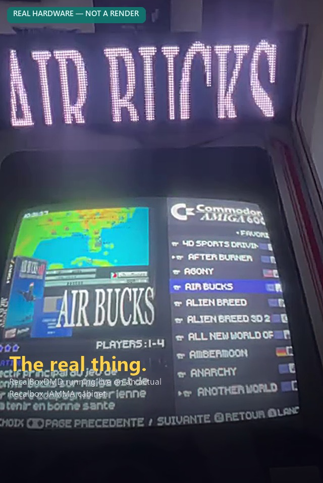
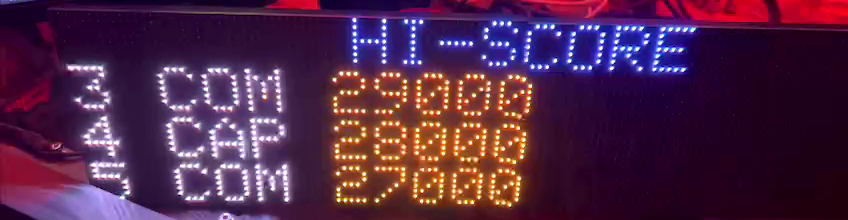

# RecalBoxDMD — RawEdition  

**A real LED marquee for your Recalbox arcade cabinet — instant display, even with a 30,000-game MAME fullset.**

🇬🇧 **English** · [🇫🇷 Français](README.fr.md) · [🇪🇸 Español](README.es.md)

> ℹ️ Already running an earlier version? See **[UPGRADING.md](UPGRADING.md)** — what's new in v13 and the one optional step (cache regeneration) to get the most out of it.

<p align="center">
  
</p>

<p align="center">
  
</p>
<p align="center"><sub>📹 Real footage, not a mockup — the marquee updates live as you browse games · <a href="medias/dmd_in_action.mp4">watch the full clip (MP4)</a></sub></p>

<p align="center">
  
  
  
  
</p>

<p align="center">
  
  
  
  
</p>

<p align="center">
  <a href="LICENSE"></a>
  
  
  
  
</p>

---

## 🎬 What's new in RawEdition v2.0

- 👉 **[Visual overview (interactive page)](https://shan-aya.github.io/RecalBoxDMD/)**

---

## What is this?

**RecalBoxDMD** turns a small **128×32 RGB LED panel** (2 chained HUB75 64×32 modules) into a real arcade marquee for your **Recalbox** cabinet: launch a game, and its logo/marquee lights up on the panel in a few milliseconds — plus a set of 10 pixel-art **clock themes** (Mario, Pac-Man, Tetris, Space Invaders, Pong...) and a bundled **pack of ~600 curated retro GIFs** for idle/attract mode.

It is a fork of [Jamyz's RetroBoxLED](https://github.com/Jamyz/RetroBoxLED), rebuilt around a custom **raw565** pixel format and a Windows **GUI toolkit** to solve one specific problem: on big collections (MAME fullset, FBNeo...) the original PNG/GIF-based firmware would freeze or show a black screen for seconds between games. This edition doesn't.

|                          | Original PNG/GIF | **RecalBoxDMD RawEdition** |
|--------------------------|-------------------|----------------------------------|
| Display time per game    | 500 ms – 3 s+     | **5 – 15 ms**                    |
| RAM needed on the ESP32  | 50–100 KB         | **8 KB**                         |
| MAME fullset (30k games) | freezes 5–10 s     | **no freeze, no black screen**   |
| Setup                    | manual, per-image  | **one-click PC toolkit**         |

> ### 🚀 The whole point: one click builds the entire SD card
>
> Point the **PC Toolkit** at your ROMs folder and hit **Start** (**Mode 1 — AUTO**). It chains everything on its own — Recalbox-version detection, gamelist extraction, raw565 conversion, bigram cache, default images, Recalbox scripts — into a ready-to-use SD card, then offers to copy it to your card for you. **Insert that SD card into the DMD, power it on, and you're done.** No manual file-by-file setup, ever.

---

## Table of Contents

1. [What is this?](#what-is-this)
2. [Key features](#key-features)
3. [How it works](#how-it-works)
4. [Screenshots](#screenshots--the-pc-toolkit)
5. [Quick start](#quick-start)
6. [Hardware](#hardware)
7. [The PC Toolkit — mode reference](#the-pc-toolkit--mode-reference)
8. [10 retro clock themes](#10-retro-clock-themes)
9. [The 600-GIF pack](#the-600-gif-pack)
10. [Firmware — compiling & flashing](#firmware--compiling--flashing)
11. [Configuration (`config.ini`)](#configuration-configini)
12. [Web configuration — live, in your browser](#web-configuration--live-in-your-browser)
13. [UDP & Telnet](#udp--telnet)
14. [In-game overlays — Hi-Score, Game Info, Achievements & RB Challenge](#in-game-overlays--hi-score-game-info-achievements--rb-challenge)
15. [Visual Pinball (VPX) tables on the DMD](#-visual-pinball-vpx-tables-on-the-dmd)
16. [The raw565 format in detail](#the-raw565-format-in-detail)
17. [SD card layout](#sd-card-layout)
18. [Repository layout](#repository-layout)
19. [Troubleshooting](#troubleshooting)
20. [Credits & License](#credits--license)

---

## Key features

- ⚡ **raw565 engine** — PNG → `.raw565` (8,192 bytes, RGB565), GIF → `.raw565pack` + `.meta`. No on-device decoding: the ESP32 just reads bytes and blits them. 5–15 ms per display.
- 🖼️ **Both fixed and animated marquees, per game or per system** — a game/system can have a still logo (`.raw565`, from PNG) **or** a full animated marquee (`.raw565pack`, from GIF); the firmware plays whichever is present, no configuration needed.
- 🎯 **Mask system for huge collections (MAME, FBNeo...)** — systems flagged **"L"** (Large/slow) instantly show a cached default image while the real one decodes in the background, so the panel **never goes black**, even scrolling through a 30,000-game fullset.
- 🖼️ **Custom fallback image** — 4 ready-made defaults are included (Recalbox, JAMMA, RGB Dual, RGB Dual 2), or pick **your own** picture from the PC Toolkit to use as the global fallback shown whenever nothing else matches.
- 🧮 **Bigram game cache** — a compact indexed cache (`games_cache.bin`) avoids listing tens of thousands of SD-card files at runtime; lookups are near-instant.
- 🕹️ **10 built-in pixel-art clock themes** — Super Mario, Tetris, Pac-Man, Space Invaders, Pong, Neon, Matrix, Fire, Rainbow, and a scrolling Level 1‑1 — shown periodically between games (or full-time), theme selectable from the web UI with **live preview on the physical panel**.
- 📦 **~600 free retro GIFs included** — an optional one-click download (Arcade, Consoles, Computers, Pinball, Halloween, Xmas, and more) for idle/attract-mode playlists.
- 🖥️ **One-click Windows PC Toolkit** (GUI, FR/EN/ES) — from raw ROMs + `gamelist.xml` to a ready-to-use SD card: scraping-aware extraction, conversion, caching, and resumable SD-card copy, all in a single "Start" click.
- 🌐 **Live web configuration page** served by the ESP32 — WiFi, UDP transport, brightness, playlist, clock themes (with instant on-panel preview) — no recompiling needed to tweak settings.
- ⚡ **Flash the firmware from your browser** — a [one-click Web Installer](https://shan-aya.github.io/RecalBoxDMD/install/) (Chrome/Edge) flashes the ESP32 over USB, no Arduino IDE required.
- 📡 **Real-time UDP link** with Recalbox for instant game/system/event display, plus a **Telnet** console for on-device debugging.
- 🏆 **In-game overlays — Hi-Score, Game Info, RetroAchievements & RB Challenge** — while you're actually playing, the panel automatically alternates the marquee with the real MAME/FBNeo top scores (community manifest, 4,087 games), the game's description/genre/year, unlocked RetroAchievements, and Recalbox's own monthly community Challenge leaderboard. Zero configuration: install the scripts once (Mode 9) and it just works — see [details below](#in-game-overlays--hi-score-game-info-achievements--rb-challenge).
- 🎯 **Visual Pinball (VPX) tables on the DMD** — launch a VPX table from Recalbox and the DMD shows the table's live DMD image, like a ZeDMD-WiFi, **with no DMD reboot**; it goes back to the normal marquee by itself when the game ends. Off by default — one switch on the web config home page, see [details below](#-visual-pinball-vpx-tables-on-the-dmd).
- 🎬 **Playlist tab — build your own attract-mode rotations** — pick any mix of the bundled 600-GIF pack and your own GIFs (drag a PC folder in), name it, and it's ready to select as the active playlist; works straight off an inserted SD card or, mid-`Mode 1`, off the working folder before it's even copied.
- 🌍 **Fully trilingual** — both the firmware's web UI and the PC toolkit are available in **French, English and Spanish**.
- 🗣️ **Multi-language system/genre images** — the `_defaults` fallback pack (genre badges, Favorites, Last Played...) is available in French and Spanish, selectable from the PC Toolkit with a live comparison preview; untranslated genres simply stay in English.
- 🔁 **Recalbox-version aware scraping** — automatically targets the right `gamelist.xml` tag and media folder for Recalbox 10.x / 9.x / legacy, with a built-in "how to scrape" guide.

---

## How it works

```
┌─────────────────────────────────────────────────────────────┐
│                          RECALBOX                            │
│   Launches a game → marquee[...].sh sends "mame/kof98"       │
│                           via UDP                           │
└──────────────────────────────┬────────────────────────────────┘
                                │
                                ▼
┌─────────────────────────────────────────────────────────────┐
│                  ESP32 + HUB75 LED Panel 128×32                │
│                                                                 │
│  Receives "mame/kof98":                                        │
│   1. /systems/mame/kof98.raw565 (or .raw565pack)  → instant    │
│   2. not found? look up games_cache.bin (bigram index)         │
│   3. still not found? show /systems/_defaults/mame.raw565      │
│   4. still not found? show /systems/_defaults/default.raw565   │
│                                                                 │
│   ⏱️  5–15 ms total, whatever the size of the collection        │
└─────────────────────────────────────────────────────────────┘

           ┌───────────────────────────────────────────────┐
           │      RecalBoxDMD Toolkit  (prepares the SD)     │
           │  Extracts marquees from gamelist.xml             │
           │  PNG → .raw565   /   GIF → .raw565pack + .meta   │
           │  Builds the bigram game cache                    │
           │  Flags slow systems ("L") for the mask system    │
           │  Downloads free assets (_defaults + 600 GIFs)    │
           │  Copies everything to the SD card (resumable)    │
           └───────────────────────────────────────────────┘
```

---

## Screenshots — the PC Toolkit

The toolkit ships with 9 visual skins (SNES, Mega Drive, Dreamcast, PlayStation, N64, Neo Geo, Game Boy, Atari 2600, Random) on top of its FR/EN/ES interface — a few examples:

| Main tab (English · SNES skin) | Settings — language & theme (English · Dreamcast skin) |
|---|---|
|  |  |

| Main tab (Français · Mega Drive skin) | Playlist tab (Français · Neo Geo skin) |
|---|---|
|  |  |

| Main tab (Español · PlayStation skin) | Advanced tab (Español · Atari 2600 skin) |
|---|---|
|  |  |

---

## Quick start

*(Also available as a standalone page: [QUICK-START.md](QUICK-START.md))*

<p align="center"><b>🚀 Zero to a working marquee in 4 steps 🚀</b></p>

<table align="center">
<tr>
<td align="center" width="70"><h2>1️⃣</h2></td>
<td>

**[Install the PC Toolkit](#install-the-pc-toolkit) + first run**
Scrape your games in Recalbox, point the toolkit at your ROMs folder, click **Start**.

</td>
</tr>
<tr>
<td align="center"><h2>2️⃣</h2></td>
<td>

**[Assemble the DMD](#hardware)**
Join the two panels, mount the DMDos board, wire it up — **~5 minutes, no soldering**.

</td>
</tr>
<tr>
<td align="center"><h2>3️⃣</h2></td>
<td>

**[Flash the firmware](#firmware--compiling--flashing)**
One-click browser installer — **no Arduino IDE required**.

</td>
</tr>
<tr>
<td align="center"><h2>4️⃣</h2></td>
<td>

**Insert the SD card, power on**
First boot walks you through Wi-Fi setup, then the **[web configuration page](#web-configuration--live-in-your-browser)** takes over for everything else (brightness, playlists, clock themes...).

</td>
</tr>
</table>

### Install the PC Toolkit

Ships four ways — grab whichever you prefer from the **[Releases page](https://github.com/shan-aya/RecalBoxDMD/releases)** (the built `.exe`/`.msi` files aren't committed to the repo itself, only released there):

**Option A — Windows installer (recommended)**

```
1. Download RecalBoxDMD_Toolkit_Setup.exe from the Releases page
2. Run it — Start Menu shortcut, optional desktop icon, proper uninstaller
3. Launch "RecalBoxDMD Toolkit" from the Start Menu
```

**Option B — Portable .exe (no install)**

```
1. Download RecalBoxDMD_GUI.exe from the Releases page
2. Run it directly — no install, no Python required, single file
```

**Option C — .msi (for scripted/group-policy deployment)**

```
1. Download the .msi from the Releases page
2. msiexec /i "RecalBoxDMD Toolkit-1.0.0-win64.msi"   (or double-click)
```

**Option D — From Python source**

```
1. Grab the tools/ folder
2. Double-click install_and_run.bat — installs Python (via winget, if
   missing), Pillow and Markdown, then launches the GUI
   (or manually: pip install Pillow Markdown && python run_gui.py)
```

### First run

```
1. Scrape your games in Recalbox (see "How to scrape?" in the tool,
   depends on your Recalbox version — logo, marquee, or cut-out logo)
2. Launch the toolkit → Main tab
3. Pick your Recalbox version (10.x / 9.x / legacy)
4. Pick your ROMs folder (e.g. D:\Recalbox\share\roms)
5. Click Start — MODE 1 runs the full pipeline automatically
6. Insert the SD card → the blinking button offers to copy it for you
```

Next: [assemble the hardware](#hardware) and [flash the firmware](#firmware--compiling--flashing) — then insert that SD card and power on.

---

## Hardware

| Component | Reference | Approx. price |
|-----------|-----------|---------------|
| 🧠 Microcontroller | ESP32 DevKit V1 USB‑C (38 pins) | ~$5 |
| 🖥️ LED panel | 2× HUB75 RGB **P4, 64×32, 256×128 mm**, joined side by side (→ 128×32) | ~$15–25/panel |
| 🔌 Connection board | **DMDos Board V3** (recommended — includes the SD reader, no soldering) | ~$15 |
| 💾 SD reader | Micro SD SPI adapter (built into the DMDos Board) | ~$2 |
| ⚡ Power supply | 5V 4A+ | ~$10 |

<p align="center">
  
</p>

The physical build (panels + DMDos Board + ESP32 + microSD) is identical to the one described on the official **[dmdos.net](https://www.dmdos.net/)** site by Mortaca — genuinely quick, no soldering, no tools beyond a screwdriver:

1. **Join the two panels.** Use the union pieces that ship with the DMDos Board. Screws aren't included — any M3 screw you have lying around works (e.g. salvaged from a power strip).
2. **Seat the DMDos Board.** Once joined, keep the back-panel component orientation identical on both sides. You'll see two identical connectors: one **input**, one **output**. The board only works on the **input** side — pick the orientation that clears the plastic bracket easily.
3. **Wire the power.** Before placing the ESP32 on top, connect each panel's red/black power leads to the board's terminals per the silkscreen (red↔red, black↔black) — keep the supplied connector and screw down a single pin, or strip/trim the cable to fit the terminal directly. Connect the two panels to each other with the included ribbon cable.
4. **SD card, ESP32, power.** Insert the SD card you prepared with the PC Toolkit (see [Quick start](#quick-start)), plug in the ESP32 already flashed with the RecalBoxDMD firmware (see [Firmware](#firmware--compiling--flashing)) on top of the board, then power everything through the ESP32's USB‑C port.

<p align="center">
  <a href="https://www.dmdos.net/#montaje" title="Full illustrated guide on dmdos.net"></a>
  <a href="https://www.dmdos.net/#montaje" title="Full illustrated guide on dmdos.net"></a>
  <a href="https://www.dmdos.net/#montaje" title="Full illustrated guide on dmdos.net"></a>
  <a href="https://www.dmdos.net/#montaje" title="Full illustrated guide on dmdos.net"></a>
</p>
<p align="center"><sub>Thumbnails link to the official step-by-step guide on dmdos.net</sub></p>

📖 **Official illustrated guide**: [dmdos.net → Hardware](https://www.dmdos.net/#hardware) · [dmdos.net → Montaje/Assembly](https://www.dmdos.net/#montaje) · [dmdos.net → Mueble/Frame](https://www.dmdos.net/#mueble)

> ⚠️ The DMDos website offers its own separate firmware/OS. **Do not flash the DMDos firmware** if you want to run RecalBoxDMD — only the **hardware** (panels, board, frame) and the **assembly guide** are reused; the firmware and SD card content come from this repository.

3D-printable frame by **Janibol** ([Retromojones](https://www.youtube.com/@retromojones)) on [Thingiverse](https://www.thingiverse.com/thing:6704880). Up-to-date purchase links: [dmdos.net](https://www.dmdos.net/).

---

## The PC Toolkit — mode reference

The GUI's **Advanced** tab groups every operation into 5 collapsible categories; **Mode 1** on the **Main** tab chains all of them for you.

| Mode | Category | Name | What it does |
|------|----------|------|---------------|
| **1** | *(Main tab)* | **AUTO — everything** | Recalbox-version detection → gamelist extraction → raw565 conversion → bigram cache → `_defaults` download → Recalbox scripts install → SD copy |
| 2 | 📥 GitHub | Download `_defaults` | Fetches the default fallback images for every known system |
| 11 | 📥 GitHub | **600-GIF pack** | One-click download of the free curated GIF collection (Arcade, Consoles, Computers, Pinball, Halloween, Xmas, Logo, and more) |
| 3 | 🗂️ Gamelist | Extraction only | Reads `gamelist.xml`, copies the right marquee/logo per your Recalbox version profile |
| 8 | 🗂️ Gamelist | Missing-images check | Reports, per system/game, whether the expected image really exists (ROMs / working folder / SD card) |
| 4 | 🖼️ Images | raw565 conversion | PNG → `.raw565`, GIF → `.raw565pack` + `.meta` |
| 5 | 🖼️ Images | 128×32 resize | Resizes PNGs to panel resolution (image format, no raw565 conversion) |
| 10 | 🖼️ Images | Fallback image | Sets/generates the global default image shown when nothing else matches |
| 6 | 🧮 Caches | Games cache | Builds `games_cache.bin` (703-entry bigram index) |
| 7 | 🧮 Caches | Systems cache | Builds `systems_cache.dat` (system index + slow/fast **"L"/"N"** flags) |
| 9 | 📜 Scripts | Install Recalbox scripts | Copies the marquee, WiFi-recovery, web-config, brightness and [Hi-Score/Game Info/Achievements/Challenge](#in-game-overlays--hi-score-game-info-achievements--rb-challenge) userscripts straight to the Recalbox's network share, cleaning up any older script names left over from a previous install |

Extra tools available from every relevant mode: **"How to scrape?"** (annotated, version-specific screenshots of Recalbox's Scraper tab), **"Clean folders before scraping"**, a **Playlist tab** to build GIF playlists from an SD card or PC folders, an adjustable **slow-system threshold** (Settings tab, default 5,000 converted files), and a **resumable SD-card copy** that survives an unplug/crash and can retry only the failed files.

---

## 10 retro clock themes

Shown periodically between games (configurable interval/duration) or full-time, each theme is a hand-built pixel-art scene — selectable from the web UI, with an **instant live preview pushed to the physical panel** as soon as you pick one.

<p align="center">
   
   
</p>
<p align="center">
   
   
</p>
<p align="center">
   
</p>

Super Mario · Tetris · Pac-Man · Space Invaders · Pong · Neon · Matrix · Fire · Rainbow · Level 1‑1 (scrolling).

### Fallback images

Shown whenever a game/system has no marquee of its own. 4 are included out of the box — or supply your own from the PC Toolkit's fallback-image picker.

<p align="center">
  
  
  
  
</p>

---

## The 600-GIF pack

**Mode 11** (or the "600-GIF pack" button in the Playlist tab) downloads a curated, ready-to-play collection of roughly **600 retro-themed GIFs**, organized by category, straight from this repository (`carte SD/gifs/`) — no external site, no account:

| Category | Category | Category |
|---|---|---|
| Arcade | Consoles | Computers |
| Pinball (short) | Pinball (story) | Logo |
| Halloween | Xmas | Other / Test suite |

Point a playlist at any subset of these folders (Playlist tab) to build your own attract-mode rotation — animated GIFs play back through the same `.raw565pack` fast-path as game marquees, so playback stays smooth even on the ESP32.

> ℹ️ One category (`XXX_Mature`) contains adult-oriented pixel art for those who want it on their own cabinet — it is entirely optional and never selected by default.

### Where does this pack come from?

These 600 GIFs are the **free sample** of **eLLuiGi**'s (RpiTeaM) "pixel perfect" animation collection for DMD clocks — 4+ years of curation, redistributed here with permission so it installs in one click, no third-party site or account needed.

The full collection goes much further: the **Ultimate GIFs DLC** bundles **~11,000 pixel-perfect animations** (1,441 Arcade, 3,601 Consoles, 849 Computers, plus Pinball/Halloween/Xmas/Logo...). It isn't hosted in this repository — it's the creator's own paid pack, get it directly from:

- 🔗 **RpiTeaM portal**: [rpiteam.carrd.co](https://rpiteam.carrd.co/)
- 🔗 **Forum thread (details & access)**: [neo-arcadia.com — "ULTIMATE GIFS DLC"](https://www.neo-arcadia.com/forum/viewtopic.php?t=67065)

Any GIF works the same way regardless of its source — but always add extra packs through the **PC Toolkit's Playlist tab** (point it at the folder on your PC) or the **web config's Media page** (upload), never by copying files onto the SD card directly: that's what rebuilds the playlist and the GIF cache the firmware actually reads. Files dropped straight onto the SD card outside those two paths won't show up until you do.

---

## Firmware — compiling & flashing

### 🌐 Option A — Flash from your browser (easiest, no install)

> [👉 **Open the RecalBoxDMD Web Installer**](https://shan-aya.github.io/RecalBoxDMD/install/)

Using **Chrome or Edge**, plug the ESP32 in via USB, click **Install**, pick the COM port, and you're done in about a minute — nothing to install on your PC, no Arduino IDE. It flashes the latest pre-built firmware straight from [`binaries/`](binaries/) using [ESP Web Tools](https://esphome.github.io/esp-web-tools/). Tick **"Erase device"** on a first install (or when coming from another firmware, e.g. DMDos) to fully wipe the flash first.

### 🛠️ Option B — Arduino IDE (for building from source / customizing)

1. Open `RecalBox_DMD.ino` in the **Arduino IDE**.
2. Install these libraries (Sketch → Include Library → Manage Libraries):

| Library | Purpose |
|---|---|
| [ESP32-HUB75-MatrixPanel-I2S-DMA](https://github.com/mrfaptastic/ESP32-HUB75-MatrixPanel-I2S-DMA) | DMA LED panel driving |
| [AnimatedGIF](https://github.com/bitbank2/AnimatedGIF) | GIF decoding (fallback path) |
| [pngle](https://github.com/kikuchan/pngle) | PNG decoding (fallback path, bundled in the sketch) |
| [WiFiManager](https://github.com/tzapu/WiFiManager) | WiFi configuration |
| [Adafruit GFX Library](https://github.com/adafruit/Adafruit-GFX-Library) | Text/shape rendering |
| [ArduinoJson](https://github.com/bblanchon/ArduinoJson) | Config & web page (de)serialization |

3. Tools → Board: **ESP32 Dev Module**, Flash size **4 MB**, Partition Scheme **Huge APP**.
4. Select the correct COM port, then **Upload**.

### ⌨️ Option C — `esptool.py` (command line)

The same pre-built binaries used by the web installer (bootloader/partitions/app/merged image) are in [`binaries/`](binaries/):

```bash
esptool.py --chip esp32 --port COM3 --baud 921600 write_flash -z 0x10000 RecalBox_DMD.ino.bin
# or, single-file flash:
esptool.py --chip esp32 --port COM3 write_flash 0x0 RecalBox_DMD.ino.merged.bin
```

### Pinout (default)

| SD card (SPI) | GPIO |  | HUB75 | GPIO |  | HUB75 | GPIO |
|---|---|---|---|---|---|---|---|
| CS | 5 | | CLK | 16 | | R1 / R2 | 25 / 14 |
| MOSI | 23 | | OE | 15 | | G1 / G2 | 26 / 12 |
| MISO | 19 | | LAT | 4 | | B1 / B2 | 27 / 13 |
| SCLK | 18 | | A/B/C/D | 33 / 32 / 22 / 17 | | E | -1 |

---

## Configuration (`config.ini`)

You never need to hand-write or copy this file: it's created automatically — either by the **PC Toolkit** (Mode 1 writes it at the end of the pipeline) or by the **ESP32 itself**, which offers its own Wi-Fi setup page on first boot / whenever it can't connect. From then on, every value below is edited live from the **web configuration page** (next section) — no SD card swap needed. For reference, here's what it contains:

```ini
# Info
info=1                        # 0 = no info at boot, 1 = show info at boot

# Display
brightness=40                 # panel brightness 0-100 %

# Playlist
playlist=RecalBox_intros.txt  # played from /playlist
random=1                      # 0 = sequential, 1 = random

# Wi-Fi
wifi_enabled=1
wifi_ssid=mywifi
wifi_password=mypassword
wifi_static_enabled=1
wifi_static_ip=192.168.1.240
wifi_gateway=192.168.1.1
wifi_subnet=255.255.255.0

# Recalbox link (UDP)
recalbox_ip=192.168.1.104     # fixed IP of your Recalbox

# Pinball (VPX) & Recalbox standby
feat_vpinball_dmd=0           # 1 = show Visual Pinball (VPX) tables live (applied at next DMD reboot)
feat_demo_follow=1            # 1 = follow the game logo during the "game demos" standby, 0 = plain playlist
feat_clip_follow=1            # same for the "game video clips" standby

# Clock (retro clock themes)
[CLOCK]
CLOCK_ENABLED=1
CLOCK_THEME=-1                # -1=random, 0=Mario ... 9=Level 1-1
CLOCK_INTERVAL=5              # number of GIFs before showing the clock
CLOCK_DURATION=60             # seconds the clock stays on screen
TZ=CET-1CEST,M3.5.0,M10.5.0/3
```

---

## Web configuration — live, in your browser

Type the ESP32's IP (shown at boot, or on the panel itself) into any phone/PC browser and you get a full settings site, split into 4 fast-loading pages, trilingual (FR/EN/ES), with a built-in help panel — no app, no recompiling.

**🏠 Home page** — the main menu opens with the **Display** frame: panel brightness with a **live preview pushed straight to the physical panel** as you drag the slider, silent vs. normal boot, and the **Pinball (VPX) mode** switch. Its Save button confirms on line 2 of the DMD.

**💡 Display & Playlists** — the in-game overlay options, **Recalbox standby** (during the "game demos" / "game video clips" screensavers, either follow the game logo as before, or just keep the simple playlist like the other screensavers), default playlist + random playback, and playlist management (create a new playlist straight from the GIF folders already on the SD card, edit or delete existing ones — for folders with a lot of files, use the PC Toolkit instead, it's built for scale).

<p align="center"></p>

**📶 Wi-Fi & Bluetooth** — network scan and selection, password, static IP (gateway/subnet/DNS), Bluetooth toggle (handy if it conflicts with a controller like the 8BitDo Pro 3), and the Recalbox IP used for the UDP link.

<p align="center"></p>

**⏰ Clock** — enable/disable, theme picker with an **instant live preview pushed to the physical panel** while the page stays open, custom neon color, GIF-count interval or minute-based interval, on-screen duration, and timezone.

<p align="center"></p>

**💿 Media** — browse and delete GIF folders straight from the SD card, and upload individual GIF files directly from the browser (fine for a few files at a time; for bulk transfers, use the PC Toolkit).

<p align="center"></p>

---

## UDP & Telnet

```
Recalbox → marquee[rungame,endgame,...].sh → UDP → ESP32 → LED panel

1. You launch "King of Fighters '98"
2. The bash userscript detects the event → publishes "mame/kof98"
3. ESP32 looks up, in order:
   a. /systems/mame/kof98.raw565 (or .raw565pack)   ← instant
   b. games_cache.bin bigram index                   ← accelerated
   c. /systems/_defaults/mame.raw565                 ← system fallback
   d. /systems/_defaults/default.raw565               ← global fallback
4. Displayed in under 15 ms
```

Install the userscript with **Mode 9** of the toolkit, or copy `marquee[...].sh` manually to `/recalbox/share/userscripts/`.

### 🎮 Manual control from the Recalbox menu

**Mode 9** also installs scripts you can trigger by hand from Recalbox (**START → Advanced Settings → User Scripts**), no SD card needed:

| Script | Effect |
|---|---|
| **WiFi Recovery DMD** | Puts the DMD back into recovery access-point (AP) mode to reconfigure WiFi. |
| **Config Web DMD** | Opens the DMD's web config page and shows its IP in Recalbox so you can reach it directly. |
| **Reboot DMD** | Reboots the DMD remotely. |
| **Luminosité DMD +10% / -10%** | Adjusts screen brightness by 10 percentage points (clamped 0-100%), applied instantly and saved to `config.ini`. |

All of these go through the same UDP channel as the marquee bridge, without ever interrupting what's currently on screen.

A **Telnet** console is built in for on-device debugging:
```
telnet <esp32-ip>
> help
```

---

## In-game overlays — Hi-Score, Game Info, Achievements & RB Challenge

<p align="center">
  
</p>

While a game is actually running (never during idle/playlist mode), the panel can automatically alternate the marquee with up to **four** community-driven overlays — full-screen, non-blocking, and always self-limited: each one reverts to the marquee on its own after a short duration, on a timer that lives **entirely on the DMD itself**, so a slow or failed Recalbox-side script can never leave the panel stuck.

- 🏆 **Hi-Score (MAME / FBNeo)** — decodes the emulator's own saved score file (`.hi`) against a community-sourced manifest converted from **hi2txt-xml** (4,087 games covered) and shows the real top rankings for that machine, exactly as MAME/FBNeo itself would show them. No live RAM reading, no per-game recipe to maintain: if a game isn't in the manifest, or its save file is missing/unexpected, nothing is shown — silent by design, never a wrong score.
- ℹ️ **Game Info** — description, genre, developer and release year, pulled straight from your existing `gamelist.xml` (the same scrape you already ran for the marquee itself).
- 🎖️ **RetroAchievements** — pops up the moment you unlock an achievement mid-game.
- 📅 **RB Challenge** — reads Recalbox's own official monthly community Challenge leaderboard (one game picked by Recalbox each month, single credit, no continue) straight from the Recalbox share — same panel, same style, no separate setup.

**Zero configuration on the DMD side.** Install the Recalbox scripts once — **Mode 9** of the PC Toolkit (or the auto-install baked into **Mode 1**) — and every one of these starts working on its own for any game/system that has data to show; the DMD stays a "dumb" display end to end, all the logic (what to send, when, how long) lives in the Recalbox-side scripts, never in the firmware itself.

---

## 🎯 Visual Pinball (VPX) tables on the DMD

The DMD can act as a **ZeDMD-WiFi** display: it speaks the same network protocol as the ZeDMD (a small HTTP handshake, then the images streamed over **UDP port 3333**), which is what the **DMDUtil** plugin of Visual Pinball uses to drive a ZeDMD over WiFi. Launch a VPX table from Recalbox and the DMD shows the table's own DMD image, live. It is **off by default**: with the option unticked, nothing changes.

### What you get

- **No reboot** when a table starts: the picture shows up directly.
- While a table runs, the **playlist and the Recalbox screens** ("Recalbox connected"…) are suspended so nothing is drawn over the table.
- **Back to normal** the moment the game ends (the Recalbox scripts tell the DMD), or about 5 seconds after the table stops sending images. The brightness you set is restored.
- Large DMDs (e.g. 192×64) are scaled down by VPX to the 128×32 panel; colorized tables show their colors.

### Setup — once

1. **On the DMD**: tick **Pinball mode (VPX)** in the *Display* frame of the web config home page, then **Save & Reboot** (the switch is only read at boot).
2. **On the Recalbox (required)**: VPX must be told to send its DMD to this panel over WiFi. In `/recalbox/share/system/configs/vpinball/VPinballX-configgen.ini`, section `[Plugin.DMDUtil]`:

   ```ini
   [Plugin.DMDUtil]
   Enable = 1
   ZeDMDWiFiEnabled = 1
   ZeDMDWiFiAddr = 192.168.1.240
   ```

   Replace `192.168.1.240` with the **IP of this DMD** (no comment at the end of a line: a `.ini` file would read it as part of the value).

   Check it: after launching a table, `vpinball.log` (same folder) must contain `ZeDMD WiFi enabled, connected to <IP of the DMD>`. If not, check the IP, that the DMD is on the same network, and that Pinball mode was enabled *and the DMD rebooted* afterwards.

   **Automatic alternative (DMD firmware v230+, scripts installed with Mode 9)**: with **Pinball mode (VPX)** ticked on the DMD, the Recalbox script `dmd_vpx_config` checks these settings (and the AlphaDMD one below) at every Recalbox start and after each game, and writes whatever is missing — never while a table is running, and it never overwrites an IP you typed yourself (it otherwise uses the one the DMD announces). **Ticking the option is therefore what authorizes the modification of the Recalbox configuration file**: unticked, the script does nothing. To disable it for good, create the file `/recalbox/share/userscripts/dmd_helpers/vpx_autoconfig.disabled`. Its log is `/recalbox/share/system/logs/dmd_vpx_config.log`.

3. **Recalbox scripts**: install them with **Mode 9** of the PC Toolkit (needed anyway for the rest of the project) — they let the DMD leave Pinball mode instantly at the end of a game.

> ⚠️ Edit `VPinballX-configgen.ini` **only while no table is running**: VPX rewrites that file when it closes, which would erase your change. A Recalbox update may also reset it.

### Optional settings, by type of table

- **Older tables with alphanumeric (segment) displays** — Bally/Williams-era PinMAME tables that only show scores: enable the **AlphaDMD** plugin (`[Plugin.AlphaDMD]` → `Enable = 1`, same file as above). Without it VPX sends nothing to the DMD for these tables and the marquee simply stays on screen.
- **Colorized tables (Serum)** — a table shipped with an `altcolor/<rom>/<rom>.cRZ` folder shows colors (and background images) only if the VPX **Serum** plugin is told where to look: add `[Plugin.Serum]` / `SerumPath = <table folder>/altcolor` to the table's own `.ini` file (next to its `.vpx`). Without it the log says `Serum: No colorization file found for <rom>` and the table stays monochrome.

### Compatibility

- **Tested** on 128×32 DMD tables (Batman), Big Bang Bar (192×64 DMD), 6 of 8 alphanumeric tables (Black Hole and Farfalla use display layouts the AlphaDMD plugin does not support) and a colorized table (Diner).
- **Nothing to display**: purely electro-mechanical tables and tables that draw their DMD with PinUP Player (e.g. Batman 66) send nothing to the DMD.
- **Only tested with Recalbox.** The DMD itself only relies on the ZeDMD-WiFi protocol, so a Visual Pinball Standalone using DMDUtil with the same `ZeDMDWiFi*` settings should be able to drive it too — untested. What is specific to Recalbox: the file locations above and the instant exit at the end of a game (without the scripts, the DMD returns to the marquee about 5 seconds after the last image).

---

## The raw565 format in detail

**`.raw565`** — still image (from PNG): exactly `128 × 32 × 2 = 8,192 bytes`, raw RGB565 (5-6-5 bits), read in a single SD operation and blitted directly (`drawRGBBitmap`).

**`.raw565pack` + `.meta`** — animated image (from GIF): all frames concatenated as raw565 blocks in `.raw565pack`; per-frame delays (`uint16`, ms) in `.meta`, loaded once into RAM. One SD open + seek per frame, zero on-device GIF decoding.

**Bigram game cache** (`games_cache.bin`) — a 703-entry-per-system index (one entry per 2-letter prefix, e.g. `KO` for `kof98`) avoids ever listing a folder with tens of thousands of files; a lookup jumps straight to the right slice of the cache.

**Mask system** — any system flagged **"L"** (more than the configurable threshold, default 5,000 converted files — MAME, FBNeo...) shows its cached default image *immediately* while a background task locates and decodes the real one, so the panel is **never** left blank.

---

## SD card layout

```
📁 SD CARD (FAT32)
├── config.ini
├── systems/
│   ├── <system>/
│   │   ├── <game>.raw565            ← still marquee
│   │   ├── <game>.raw565pack        ← animated marquee (frames)
│   │   └── <game>.meta              ← animated marquee (timings)
│   └── _defaults/
│       ├── default.raw565           ← global fallback
│       └── <system>.raw565          ← per-system fallback, in the chosen
│                                       language (EN by default; FR/ES
│                                       versions overwrite this same file
│                                       in place if selected in the Toolkit)
├── gifs/                            ← attract-mode playlists (600-GIF pack lands here)
│   ├── Arcade/  Consoles/  Computers/  Pinball_Short/  Pinball_Story/
│   └── Halloween/  XMAS/  Logo/  Other/ ...
├── playlists/
│   └── <playlist_name>.txt
├── games_cache.bin                  ← bigram index
└── systems_cache.dat                ← system index + L/N flags
```

---

## Repository layout

```
RecalBox_DMD.ino / *.h        ← ESP32 firmware source (Arduino IDE project)
binaries/                     ← pre-built firmware images (bootloader/app/merged)
tools/                        ← PC Toolkit (Python GUI, FR/EN/ES) + Windows build
carte SD/                     ← ready-to-copy SD card content (gifs, system defaults, userscripts)
medias/                       ← screenshots, clock-theme demo GIFs, press kit
docs/                          ← GitHub Pages: presentation homepage (shan-aya.github.io/RecalBoxDMD) + browser-based Web Installer (…/install/)
```

---

## Troubleshooting

For freezes, display corruption, WiFi setup loops, or a DMD that seems to lose sync with Recalbox, see the dedicated **[FAQ & Troubleshooting](FAQ.md)** page first — it covers the most common causes (USB power, microSD card quality, ESP32 chip revision) in more detail than fits here.

| Problem | Fix |
|---|---|
| "Pillow is not installed" | Auto-installed on first run; if it fails: `pip install Pillow` |
| "GitHub API unreachable" | `_defaults`/600-GIF-pack downloads need an internet connection; retry later (rate-limited) |
| No removable drive detected | Insert/re-check the SD card is visible in Windows Explorer |
| ESP32 shows nothing | Check power (5V 4A min.), `config.ini` at SD root, HUB75 wiring; try Telnet `help` |
| ESP32 not detected (no COM port) | Install USB drivers: [CP2102 (Silicon Labs)](https://www.silabs.com/developers/usb-to-uart-bridge-vcp-drivers) or [CH340/CH341](https://learn.sparkfun.com/tutorials/how-to-install-ch340-drivers/all) |
| Slow display / black screen between games | Confirm you ran **Mode 1**; check the system is flagged `L` in `systems_cache.dat`; raise the slow-flag threshold (Settings tab) if your SD card is fast |
| Wrong image shows (box art instead of logo) | Check the **Recalbox version** profile and use **"How to scrape?"**; run **Mode 8** to verify what's actually present |

---

## Credits & License

- **Original RetroBoxLED project**: [Jamyz](https://github.com/Jamyz/RetroBoxLED) — the ESP32 firmware base and idea
- **RawEdition**: **Shan_ayA** — raw565 format, bigram cache, mask system, PC toolkit, clock themes, Recalbox-version handling, web live-preview
- **Inspiration**: [RetroPixelLED](https://github.com/fjgordillo86/RetroPixelLED) by fjgordillo86
- **600-GIF pack**: **eLLuiGi** / [RpiTeaM](https://rpiteam.carrd.co/) — free sample of their curated retro GIF collection
- **Hi-Score manifest**: converted from the community **hi2txt-xml** format built around MAME's own `hiscore.dat` project — 4,087 games covered
- **Hardware & assembly guide**: [Mortaca — DMDos Board](https://www.mortaca.com/) / [dmdos.net](https://www.dmdos.net/)
- **3D frame**: Janibol — [Retromojones](https://www.youtube.com/@retromojones)
- **Community**: [Recalbox](https://www.recalbox.com/)
- **Development**: written with the assistance of [Claude](https://www.anthropic.com/claude) (Anthropic) — AI-assisted coding throughout the firmware and PC toolkit

📜 Full version history: [CHANGELOG.md](CHANGELOG.md)

Licensed under the [MIT License](LICENSE).

☕ If this project helps you: [donate via PayPal](https://www.paypal.com/paypalme/felysaya)

<p align="center"><i>RecalBoxDMD RawEdition — Recalbox + a real LED marquee, instant even with 30,000 MAME games.</i> 🎮⚡</p>
